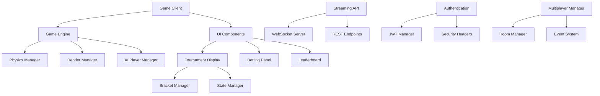

# Memex Racing API Documentation

Welcome to the comprehensive API documentation for Memex Racing, a top-down multiplayer racing betting game with retro pixel art aesthetics.

## Overview

Memex Racing provides a rich set of APIs for game development, tournament management, streaming integration, and UI customization. This documentation covers all public APIs and integration points for developers, content creators, and system integrators.

## API Categories

### 🎮 [Game Engine API](./game-engine.md)
Core game engine functionality including player management, race logic, physics, and rendering systems.

### 🏆 [Tournament API](./tournament-api.md)
Complete tournament management system with bracket generation, player seeding, and multi-format support.

### 📺 [Streaming API](./streaming-api.md)
Real-time streaming data endpoints for OBS overlays, tournament broadcasting, and external integrations.

### 🎨 [UI Components API](./ui-components.md)
Modular UI component system for betting panels, leaderboards, tournament displays, and customization tools.

## Quick Start Guides

### 🚀 [Integration Guide](../integration-guide.md)
Step-by-step guide for integrating Memex Racing into your application or platform.

### 🎨 [Customization Guide](../customization-guide.md)
Complete guide for customizing game assets, UI themes, and gameplay parameters.

## Architecture Overview



## Core Technologies

- **Frontend**: Phaser.js 3.x, HTML5 Canvas, WebSocket
- **Backend**: Node.js, Express.js, Socket.io
- **Authentication**: JWT tokens, CSRF protection
- **Database**: JSON file storage, configurable backends
- **Testing**: Jest, Playwright, custom test frameworks

## Configuration System

All APIs support extensive configuration through JSON schema-validated config files:

```javascript
// Basic initialization
const gameEngine = new GameEngine({
  width: 1920,
  height: 1080,
  maxPlayers: 6,
  raceTimeLimit: 300
});

// With advanced configuration
const gameEngine = new GameEngine({
  configManager: {
    enableHotReload: true,
    configPaths: ['./config/custom-game.json']
  }
});
```

## Event-Driven Architecture

The game uses a comprehensive event system for real-time communication:

```javascript
// Subscribe to game events
gameEngine.on('race:started', (raceData) => {
  console.log('Race started with', raceData.players.length, 'players');
});

// Tournament events
tournamentManager.on('tournament:bracket_updated', (bracket) => {
  updateBracketDisplay(bracket);
});

// Streaming events
streamingAPI.on('viewer_count_changed', (count) => {
  updateViewerCount(count);
});
```

## API Authentication

Most APIs support optional authentication for enhanced features:

```javascript
// Anonymous access (limited features)
const api = new StreamingAPI();

// Authenticated access (full features)
const api = new StreamingAPI({
  authManager: authManager,
  enablePrivateEndpoints: true
});
```

## Rate Limiting

All public APIs include built-in rate limiting:

- **Game Engine**: 60 FPS game state updates
- **Streaming API**: 10 requests/second per IP
- **Tournament API**: 100 requests/minute per user
- **WebSocket**: Connection-based throttling

## Error Handling

Consistent error handling across all APIs:

```javascript
// Standardized error response
{
  "success": false,
  "error": {
    "code": "INVALID_PLAYER_COUNT",
    "message": "Player count must be between 2 and 6",
    "details": {
      "provided": 8,
      "min": 2,
      "max": 6
    }
  }
}

// Success response
{
  "success": true,
  "data": {
    "raceId": "race_123",
    "players": [...],
    "startTime": "2024-01-15T10:30:00Z"
  }
}
```

## Performance Considerations

### Memory Management
- Built-in LRU caching for frequently accessed data
- Automatic cleanup of inactive tournaments and races
- Configurable memory limits and monitoring

### Optimization Features
- Asset lazy loading and prefetching
- WebSocket message batching
- Efficient sprite rendering for 32x32/64x64 assets

### Scalability
- Horizontal scaling support for tournament systems
- Load balancing for multiple game instances
- Database abstraction for easy backend switching

## Development Tools

### Debug Mode
Enable comprehensive debugging across all systems:

```javascript
// Enable debug mode
const gameEngine = new GameEngine({
  debug: {
    enabled: true,
    showPhysics: true,
    logEvents: true,
    monitorPerformance: true
  }
});
```

### Testing Utilities
Built-in testing helpers for API validation:

```javascript
import { APITestRunner } from 'memex-racing/testing';

const testRunner = new APITestRunner();
await testRunner.validateTournamentAPI();
await testRunner.validateStreamingEndpoints();
```

## Browser Compatibility

- **Chrome**: 80+
- **Firefox**: 75+
- **Safari**: 13+
- **Edge**: 80+

## Mobile Support

Limited mobile API support for spectator features:
- Streaming data consumption
- Tournament bracket viewing
- Betting interface (touch-optimized)

## Security Features

- CSRF protection on all state-changing operations
- Rate limiting and DDoS protection
- Input validation and sanitization
- Secure WebSocket connections (WSS)
- JWT token authentication with refresh

## Community & Support

### GitHub Repository
- Issue tracking and feature requests
- API examples and sample code
- Community-contributed extensions

### API Versioning
- Semantic versioning (v1.2.3)
- Backward compatibility guarantees
- Migration guides for major versions

### Documentation Updates
- Real-time documentation sync with code
- Interactive API explorer (coming soon)
- Community-driven examples and tutorials

## Next Steps

1. **New to Memex Racing?** Start with the [Integration Guide](../integration-guide.md)
2. **Building streaming tools?** Check out the [Streaming API](./streaming-api.md)
3. **Creating tournaments?** Explore the [Tournament API](./tournament-api.md)
4. **Customizing the UI?** Review the [UI Components API](./ui-components.md)
5. **Game development?** Dive into the [Game Engine API](./game-engine.md)

---

*Last updated: January 2024 | Version: 1.0.0*