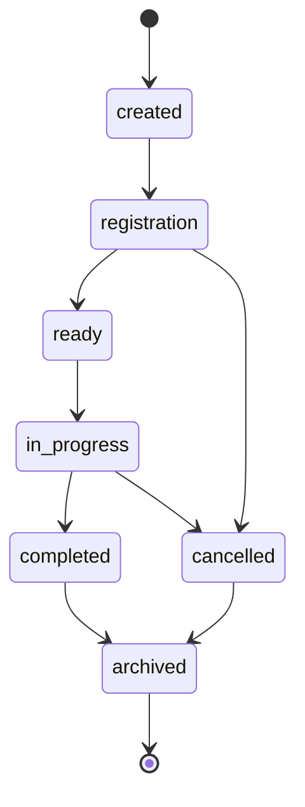

# Tournament API Reference

The Tournament API provides comprehensive tournament management capabilities for Memex Racing, supporting multiple tournament formats, player registration, bracket management, and real-time tournament state tracking.

## Table of Contents

- [Overview](#overview)
- [Quick Start](#quick-start)
- [TournamentManager](#tournamentmanager)
- [BracketManager](#bracketmanager)
- [Tournament Formats](#tournament-formats)
- [State Management](#state-management)
- [Streaming Integration](#streaming-integration)
- [Configuration](#configuration)
- [Events](#events)
- [Error Handling](#error-handling)

## Overview

The Tournament system consists of several interconnected components:

- **TournamentManager**: High-level tournament orchestration
- **BracketManager**: Bracket generation and management
- **TournamentStateManager**: State persistence and synchronization
- **Tournament Formats**: Pluggable format implementations
- **Streaming Integration**: Real-time data for broadcasting

## Quick Start

### Basic Tournament Creation

```javascript
import { TournamentManager } from 'memex-racing/tournament';

// Initialize tournament manager
const tournamentManager = new TournamentManager(authManager, gameEngine);

// Create a tournament
const tournament = await tournamentManager.createTournament({
  name: "Weekly Championship",
  format: "single_elimination",
  maxPlayers: 16,
  minPlayers: 4,
  raceTimeLimit: 300,
  bettingEnabled: true,
  prizePool: 1000
});

console.log(`Tournament created: ${tournament.id}`);
```

### Player Registration

```javascript
// Register players
await tournamentManager.registerPlayer(tournament.id, "player1", {
  displayName: "SpeedRacer",
  skill_level: "intermediate"
});

// Start tournament when ready
await tournamentManager.startTournament(tournament.id);
```

### Real-time Updates

```javascript
// Subscribe to tournament events
tournamentManager.on('tournament:bracket_updated', (data) => {
  console.log('Bracket updated:', data.bracket);
  updateBracketDisplay(data.bracket);
});

tournamentManager.on('tournament:match_completed', (data) => {
  console.log('Match completed:', data.match);
  advancePlayers(data.winners);
});
```

## TournamentManager

The main orchestration class for tournament lifecycle management.

### Constructor

```javascript
new TournamentManager(authManager, gameEngine, options)
```

**Parameters:**
- `authManager` (AuthManager, optional): Authentication manager instance
- `gameEngine` (GameEngine, optional): Game engine instance
- `options` (Object, optional): Configuration options

**Options:**
```javascript
{
  maxConcurrentTournaments: 5,
  defaultTournamentSettings: {
    format: 'single_elimination',
    maxPlayers: 32,
    minPlayers: 4,
    raceTimeLimit: 300,
    playersPerRace: 6,
    bettingEnabled: true,
    spectatorCount: 50,
    registrationTimeLimit: 600,
    prizePool: 0
  }
}
```

### Methods

#### createTournament(settings)

Creates a new tournament with specified settings.

```javascript
const tournament = await tournamentManager.createTournament({
  name: "Summer Cup 2024",
  description: "Annual summer championship",
  format: "double_elimination", 
  maxPlayers: 32,
  minPlayers: 8,
  raceTimeLimit: 240,
  playersPerRace: 4,
  bettingEnabled: true,
  spectatorCount: 100,
  registrationTimeLimit: 900, // 15 minutes
  prizePool: 5000,
  entryFee: 50,
  visibility: "public", // public, private, unlisted
  tags: ["championship", "summer", "premium"],
  schedule: {
    registrationStart: "2024-06-01T10:00:00Z",
    registrationEnd: "2024-06-01T10:15:00Z",
    tournamentStart: "2024-06-01T10:30:00Z"
  }
});
```

**Returns:** Tournament object with generated ID and initial state.

#### registerPlayer(tournamentId, playerId, playerData)

Registers a player for a tournament.

```javascript
const registration = await tournamentManager.registerPlayer(
  "tournament_123", 
  "player_456", 
  {
    displayName: "RacingLegend",
    skill_level: "expert", // beginner, intermediate, expert, pro
    preferredCharacter: "cool_pug",
    teamAffiliation: "Team Velocity",
    country: "US",
    timezone: "America/New_York"
  }
);
```

**Returns:** Registration confirmation with seeding information.

#### startTournament(tournamentId)

Starts a tournament and generates the initial bracket.

```javascript
const result = await tournamentManager.startTournament("tournament_123");
// Returns: { success: true, bracket: BracketData, firstMatches: [...] }
```

#### advancePlayer(tournamentId, matchId, winnerId, matchResults)

Advances a player to the next round after a match completion.

```javascript
await tournamentManager.advancePlayer(
  "tournament_123",
  "match_456", 
  "player_winner",
  {
    race_time: 287.4,
    final_positions: ["player_winner", "player_2", "player_3"],
    betting_total: 2500,
    spectator_count: 45
  }
);
```

#### getTournamentStatus(tournamentId)

Retrieves comprehensive tournament status.

```javascript
const status = await tournamentManager.getTournamentStatus("tournament_123");

// Returns:
{
  tournament: {
    id: "tournament_123",
    name: "Summer Cup 2024",
    status: "in_progress", // registration, ready, in_progress, completed, cancelled
    currentRound: 2,
    totalRounds: 4
  },
  bracket: { /* bracket data */ },
  activeMatches: [ /* current matches */ ],
  upcomingMatches: [ /* next matches */ ],
  statistics: {
    totalPlayers: 16,
    activePlayers: 8,
    eliminatedPlayers: 8,
    totalRaces: 12,
    averageRaceTime: 245.6
  }
}
```

#### cancelTournament(tournamentId, reason)

Cancels a tournament and handles cleanup.

```javascript
await tournamentManager.cancelTournament("tournament_123", {
  reason: "insufficient_players",
  message: "Tournament cancelled due to insufficient registrations",
  refund: true
});
```

### Tournament Status Lifecycle



## BracketManager

Handles bracket generation, seeding, and match progression.

### Constructor

```javascript
const bracketManager = new BracketManager(options);
```

### Methods

#### generateBracket(players, format, options)

Generates a tournament bracket based on format and seeding.

```javascript
const bracket = bracketManager.generateBracket(
  players, 
  'single_elimination',
  {
    seeding: 'random', // random, skill_based, manual
    balanceGroups: true,
    allowByes: true
  }
);
```

**Seeding Options:**
- `random`: Random player placement
- `skill_based`: Based on player skill ratings
- `manual`: Custom seeding order provided
- `geographic`: Balance by geographic regions
- `team_balanced`: Separate team members

#### updateBracket(bracketId, matchResult)

Updates bracket after match completion.

```javascript
const updatedBracket = bracketManager.updateBracket("bracket_123", {
  matchId: "match_456",
  winner: "player_789",
  loser: "player_101",
  matchData: {
    duration: 287.4,
    positions: ["player_789", "player_101", "player_102"],
    disqualifications: [],
    technical_issues: false
  }
});
```

#### getBracketVisualization(bracketId, format)

Generates bracket visualization data for UI rendering.

```javascript
const visualization = bracketManager.getBracketVisualization(
  "bracket_123", 
  'tree' // tree, grid, list
);

// Returns structured data for different visualization formats
{
  format: 'tree',
  rounds: [
    {
      round: 1,
      matches: [
        {
          id: "match_1",
          players: ["player_1", "player_2"],
          winner: null,
          status: "pending"
        }
      ]
    }
  ],
  metadata: {
    totalRounds: 4,
    playersRemaining: 8,
    nextMatch: "match_5"
  }
}
```

## Tournament Formats

### Single Elimination

Traditional knockout tournament where losing eliminates players.

```javascript
import { SingleElimination } from 'memex-racing/tournament/formats';

const format = new SingleElimination({
  allowByes: true,
  thirdPlacePlayoff: false,
  seeding: 'skill_based'
});
```

**Configuration Options:**
- `allowByes`: Allow bye rounds for uneven player counts
- `thirdPlacePlayoff`: Include 3rd/4th place match
- `seeding`: Player seeding strategy
- `consolationBracket`: Secondary bracket for early eliminations

### Double Elimination

Players must lose twice to be eliminated, with winner/loser brackets.

```javascript
import { DoubleElimination } from 'memex-racing/tournament/formats';

const format = new DoubleElimination({
  resetFinal: true, // Winner bracket must beat loser bracket twice
  seeding: 'random',
  bracketAdvantage: false // Winner bracket gets advantage in final
});
```

**Configuration Options:**
- `resetFinal`: Reset grand final if loser bracket wins
- `bracketAdvantage`: Advantage for winner bracket in grand final
- `seeding`: Player placement strategy
- `minimumMatches`: Guarantee minimum matches per player

### Round Robin

Every player plays every other player.

```javascript
import { RoundRobin } from 'memex-racing/tournament/formats';

const format = new RoundRobin({
  groupStage: true,
  groupSize: 4,
  advanceFromGroup: 2,
  tiebreakers: ['head_to_head', 'race_time', 'random']
});
```

**Configuration Options:**
- `groupStage`: Divide into groups first
- `groupSize`: Players per group
- `advanceFromGroup`: Top N players advance
- `tiebreakers`: Tiebreaker priority order
- `doubleRoundRobin`: Play each opponent twice

### Custom Format Example

```javascript
import { TournamentFormat } from 'memex-racing/tournament/formats';

class CustomSwiss extends TournamentFormat {
  constructor(options = {}) {
    super('swiss', options);
    this.rounds = options.rounds || 5;
  }

  generateBracket(players) {
    // Custom Swiss pairing logic
    return {
      format: 'swiss',
      rounds: this.rounds,
      matches: this.generateSwissPairings(players)
    };
  }

  advancePlayer(bracket, matchResult) {
    // Custom advancement logic
    return this.updateSwissStandings(bracket, matchResult);
  }
}
```

## State Management

Tournament state is managed through the TournamentStateManager for persistence and synchronization.

### State Structure

```javascript
{
  tournament: {
    id: "tournament_123",
    settings: { /* tournament configuration */ },
    status: "in_progress",
    created_at: "2024-01-15T10:00:00Z",
    started_at: "2024-01-15T10:30:00Z",
    completed_at: null
  },
  players: {
    "player_1": {
      id: "player_1",
      displayName: "SpeedDemon",
      status: "active", // active, eliminated, disqualified
      currentRound: 2,
      wins: 3,
      losses: 1,
      totalRaceTime: 1245.6
    }
  },
  bracket: {
    format: "single_elimination",
    rounds: [ /* round data */ ],
    currentRound: 2
  },
  matches: {
    "match_1": {
      id: "match_1",
      round: 1,
      players: ["player_1", "player_2"],
      winner: "player_1",
      status: "completed",
      raceData: { /* race results */ }
    }
  },
  statistics: {
    totalRaces: 12,
    averageRaceTime: 245.6,
    totalBetting: 15000,
    peakSpectators: 150
  }
}
```

### Persistence Options

```javascript
// File-based persistence (default)
const stateManager = new TournamentStateManager({
  persistence: 'file',
  dataPath: './data/tournaments'
});

// Memory-only (testing)
const stateManager = new TournamentStateManager({
  persistence: 'memory'
});

// Custom persistence adapter
const stateManager = new TournamentStateManager({
  persistence: 'custom',
  adapter: new CustomPersistenceAdapter()
});
```

## Streaming Integration

Tournament data can be exposed for streaming and broadcasting.

### Real-time Tournament Data

```javascript
import { TournamentStreamingIntegration } from 'memex-racing/tournament';

const streaming = new TournamentStreamingIntegration(tournamentManager);

// Enable tournament streaming
streaming.enableTournamentStream("tournament_123", {
  includePlayerStats: true,
  includeBettingData: true,
  includeSpectatorCount: true,
  updateInterval: 1000 // 1 second
});

// Access streaming endpoints
// GET /api/tournament/tournament_123/bracket
// GET /api/tournament/tournament_123/current-match
// WebSocket: ws://localhost:3001/tournament/tournament_123
```

### Overlay Data Format

```javascript
{
  tournament: {
    name: "Summer Cup 2024",
    currentRound: "Semi-Finals",
    status: "in_progress"
  },
  currentMatch: {
    id: "match_semifinal_1",
    players: [
      {
        name: "SpeedDemon",
        position: { x: 150, y: 200 },
        character: "cool_pug",
        betOdds: "2.5:1"
      }
    ],
    timeRemaining: 187,
    spectators: 234,
    totalBets: 5670
  },
  bracket: {
    visualization: "tree",
    data: { /* bracket visualization data */ }
  }
}
```

## Configuration

### Default Tournament Settings

```javascript
const defaultSettings = {
  // Basic settings
  format: 'single_elimination',
  maxPlayers: 32,
  minPlayers: 4,
  raceTimeLimit: 300,
  playersPerRace: 6,
  bettingEnabled: true,
  spectatorCount: 50,
  registrationTimeLimit: 600,
  prizePool: 0,
  
  // Advanced settings
  autoStart: false,
  allowLateRegistration: false,
  requireApproval: false,
  visibility: 'public',
  
  // Format-specific settings
  formatOptions: {
    seeding: 'random',
    allowByes: true,
    tiebreakers: ['head_to_head', 'race_time']
  },
  
  // Integration settings
  streaming: {
    enabled: false,
    publicAPI: true,
    overlayData: true
  },
  
  // Notification settings
  notifications: {
    registration: true,
    matchStart: true,
    roundAdvancement: true,
    tournamentComplete: true
  }
};
```

### Schema Validation

All tournament configurations are validated against JSON schemas:

```javascript
// tournaments.schema.json
{
  "$schema": "http://json-schema.org/draft-07/schema#",
  "type": "object",
  "properties": {
    "name": {
      "type": "string", 
      "minLength": 3,
      "maxLength": 100
    },
    "format": {
      "enum": ["single_elimination", "double_elimination", "round_robin"]
    },
    "maxPlayers": {
      "type": "integer",
      "minimum": 4,
      "maximum": 256
    }
  },
  "required": ["name", "format", "maxPlayers"]
}
```

## Events

The Tournament API emits comprehensive events for real-time updates.

### Tournament Events

```javascript
// Tournament lifecycle
tournamentManager.on('tournament:created', (tournament) => {});
tournamentManager.on('tournament:registration_opened', (tournament) => {});
tournamentManager.on('tournament:registration_closed', (tournament) => {});
tournamentManager.on('tournament:started', (tournament) => {});
tournamentManager.on('tournament:completed', (tournament) => {});
tournamentManager.on('tournament:cancelled', (tournament) => {});

// Player events
tournamentManager.on('player:registered', (data) => {
  // data: { tournamentId, playerId, playerData, totalPlayers }
});
tournamentManager.on('player:unregistered', (data) => {});
tournamentManager.on('player:eliminated', (data) => {});
tournamentManager.on('player:advanced', (data) => {});

// Match events
tournamentManager.on('match:scheduled', (match) => {});
tournamentManager.on('match:started', (match) => {});
tournamentManager.on('match:completed', (match) => {});
tournamentManager.on('match:cancelled', (match) => {});

// Bracket events
tournamentManager.on('bracket:generated', (bracket) => {});
tournamentManager.on('bracket:updated', (bracket) => {});
tournamentManager.on('round:completed', (roundData) => {});
```

### Event Data Examples

```javascript
// Tournament completed event
{
  tournament: {
    id: "tournament_123",
    name: "Summer Cup 2024",
    winner: "player_champion",
    runner_up: "player_second",
    total_players: 32,
    total_races: 31,
    duration: 7200, // seconds
    prize_distribution: {
      "player_champion": 2500,
      "player_second": 1500,
      "player_third": 1000
    }
  },
  statistics: {
    average_race_time: 245.6,
    fastest_race: 198.3,
    total_betting: 45000,
    peak_spectators: 250
  }
}

// Match completed event
{
  match: {
    id: "match_final",
    round: 5,
    players: ["player_1", "player_2", "player_3"],
    winner: "player_1",
    positions: ["player_1", "player_2", "player_3"],
    race_time: 234.5,
    eliminated: ["player_2", "player_3"]
  },
  tournament: {
    id: "tournament_123",
    status: "completed"
  },
  next_matches: []
}
```

## Error Handling

### Common Error Codes

```javascript
// Tournament errors
TOURNAMENT_NOT_FOUND: "Tournament does not exist"
TOURNAMENT_FULL: "Tournament has reached maximum player capacity"
REGISTRATION_CLOSED: "Registration period has ended"
TOURNAMENT_ALREADY_STARTED: "Tournament has already begun"
INVALID_TOURNAMENT_FORMAT: "Unsupported tournament format"

// Player errors
PLAYER_ALREADY_REGISTERED: "Player is already registered for this tournament"
PLAYER_NOT_REGISTERED: "Player is not registered for this tournament"
INSUFFICIENT_SKILL_RATING: "Player does not meet minimum skill requirements"
DUPLICATE_PLAYER_NAME: "Display name is already in use"

// Match errors
MATCH_NOT_FOUND: "Match does not exist"
MATCH_ALREADY_COMPLETED: "Match has already been completed"
INVALID_MATCH_RESULT: "Match result validation failed"
PLAYER_NOT_IN_MATCH: "Player is not participating in this match"

// Format errors
INVALID_BRACKET_SIZE: "Player count incompatible with tournament format"
SEEDING_FAILED: "Unable to generate valid seeding"
BRACKET_CORRUPTION: "Bracket data integrity check failed"
```

### Error Response Format

```javascript
{
  "success": false,
  "error": {
    "code": "TOURNAMENT_FULL",
    "message": "Tournament has reached maximum player capacity",
    "details": {
      "tournament_id": "tournament_123",
      "current_players": 32,
      "max_players": 32,
      "waitlist_available": true
    },
    "suggestions": [
      "Join the waitlist for this tournament",
      "Look for other available tournaments",
      "Create your own tournament"
    ]
  },
  "timestamp": "2024-01-15T10:30:00Z",
  "request_id": "req_abc123"
}
```

### Error Handling Best Practices

```javascript
try {
  const tournament = await tournamentManager.createTournament(settings);
  console.log('Tournament created:', tournament.id);
} catch (error) {
  if (error.code === 'INVALID_TOURNAMENT_FORMAT') {
    // Handle format-specific error
    console.error('Unsupported format:', error.details.format);
    showFormatSelector();
  } else if (error.code === 'INSUFFICIENT_PERMISSIONS') {
    // Handle auth error
    console.error('Permission denied:', error.message);
    redirectToLogin();
  } else {
    // Handle generic error
    console.error('Tournament creation failed:', error.message);
    showErrorNotification(error.message);
  }
}
```

## Testing

### Unit Testing

```javascript
import { TournamentManager } from 'memex-racing/tournament';
import { createMockAuthManager } from 'memex-racing/testing';

describe('TournamentManager', () => {
  let tournamentManager;
  let mockAuth;

  beforeEach(() => {
    mockAuth = createMockAuthManager();
    tournamentManager = new TournamentManager(mockAuth);
  });

  test('creates tournament with valid settings', async () => {
    const tournament = await tournamentManager.createTournament({
      name: 'Test Tournament',
      format: 'single_elimination',
      maxPlayers: 8
    });

    expect(tournament.id).toBeDefined();
    expect(tournament.name).toBe('Test Tournament');
    expect(tournament.status).toBe('registration');
  });
});
```

### Integration Testing

```javascript
import { TournamentTestRunner } from 'memex-racing/testing';

const testRunner = new TournamentTestRunner();

// Run full tournament simulation
await testRunner.simulateCompleteTournament({
  players: 16,
  format: 'single_elimination',
  raceCount: 15
});

// Validate bracket integrity
await testRunner.validateBracketIntegrity();

// Test concurrent tournaments
await testRunner.testConcurrentTournaments(3);
```

---

*For more examples and advanced usage, see the [Integration Guide](../integration-guide.md) and [GitHub repository](https://github.com/memex-racing/api-examples).*