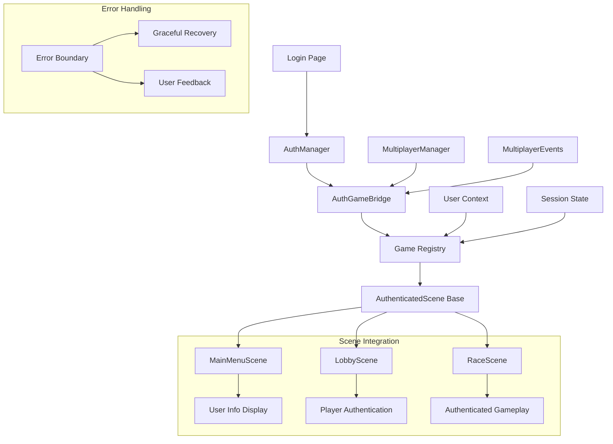

# Technical Design: Authentication Integration Fixes

## Architecture Overview
This design addresses critical authentication integration issues by completing the scene integration, fixing the authentication flow, and resolving test failures. The solution maintains backward compatibility while ensuring proper separation of concerns between authentication and game logic.



## Technology Stack
- Frontend: Phaser.js 3.x, JavaScript ES6+
- Authentication: JWT-based with existing AuthManager
- Testing: Jest for unit tests, integration test suites
- Error Handling: Custom error boundaries with recovery mechanisms

## Component Design

### Component: Scene Integration Fix
- **Purpose**: Complete the authentication integration for all game scenes
- **Interfaces**: AuthGameBridge API, AuthenticatedScene base class
- **Dependencies**: Existing AuthManager, Phaser.js game registry

**Key Changes:**
1. Update MainMenuScene to use AuthGameBridge instead of window.authManager
2. Make LobbyScene and RaceScene extend AuthenticatedScene
3. Ensure proper user context propagation

### Component: Authentication Flow Repair
- **Purpose**: Fix the login-to-game redirect flow
- **Interfaces**: AuthManager.login(), game initialization flow
- **Dependencies**: Login page, game entry point

**Key Changes:**
1. Fix redirect URL configuration
2. Ensure proper game initialization with user context
3. Add proper error handling for failed authentications

### Component: Multiplayer Authentication Integration
- **Purpose**: Connect multiplayer system with authenticated user data
- **Interfaces**: MultiplayerManager, MultiplayerEvents, AuthGameBridge
- **Dependencies**: Socket.io, user context system

**Key Changes:**
1. Update multiplayer connection to use authenticated user ID
2. Add user validation for multiplayer actions
3. Display authenticated usernames in player lists

### Component: Test Suite Fixes
- **Purpose**: Resolve the 23 failing tests
- **Interfaces**: Jest test framework, authentication components
- **Dependencies**: Test configuration, mock implementations

**Key Changes:**
1. Fix password validation test expectations
2. Resolve crypto/encryption configuration issues
3. Update integration test scenarios

## Data Model

### User Context Structure
```javascript
const userContext = {
  id: "string",
  username: "string", 
  email: "string",
  auth: {
    permissions: ["array", "of", "permissions"],
    roles: ["array", "of", "roles"]
  },
  statistics: {
    level: "number",
    totalPoints: "number",
    gamesPlayed: "number",
    wins: "number"
  },
  preferences: {
    soundEnabled: "boolean",
    musicVolume: "number",
    effectsVolume: "number",
    playerColor: "string"
  }
};
```

### Authentication State
```javascript
const authState = {
  isAuthenticated: "boolean",
  userContext: "object|null",
  sessionExpiry: "timestamp",
  lastUpdate: "timestamp"
};
```

## API Design

### AuthGameBridge API Updates
```javascript
class AuthGameBridge {
  // Existing methods maintained
  initializeUserContext(userData)
  updateUserContext(userData) 
  clearUserContext()
  getUserContext()
  
  // Enhanced methods for scene integration
  propagateToAllScenes(userData)
  validateSceneAccess(sceneName, permissions)
  handleAuthenticationError(error, context)
}
```

### AuthenticatedScene API
```javascript
class AuthenticatedScene extends Phaser.Scene {
  // User data access
  getUser()
  getUserId()
  getUsername()
  hasPermission(permission)
  
  // Lifecycle hooks
  onAuthContextReady(userContext, isAuthenticated)
  onUserContextUpdate(userData)
  onAuthStateChange(stateChange)
  
  // Utility methods
  requireAuth(permissions)
  redirectToAuth()
  displayUserInfo(x, y, style)
}
```

## Implementation Strategy

### Phase 1: Scene Integration Fixes (2 hours)
1. **Fix MainMenuScene Integration**
   - Replace window.authManager calls with AuthGameBridge
   - Update user info display logic
   - Test authentication state handling

2. **Update LobbyScene and RaceScene**
   - Make both scenes extend AuthenticatedScene
   - Implement user context access methods
   - Add proper error handling

3. **Test Scene Integration**
   - Verify user context propagation
   - Test authentication state changes
   - Validate error scenarios

### Phase 2: Authentication Flow Repair (1.5 hours)
1. **Fix Login Redirect**
   - Update login success handler
   - Ensure proper game initialization
   - Add error feedback mechanisms

2. **Session Management**
   - Fix session expiration handling
   - Add graceful logout functionality
   - Test edge cases

### Phase 3: Multiplayer Integration (1.5 hours)
1. **Update MultiplayerManager**
   - Integrate with AuthGameBridge
   - Use authenticated user IDs
   - Add permission validation

2. **Update MultiplayerEvents**
   - Pass authenticated user data
   - Validate user actions
   - Handle authentication errors

### Phase 4: Test Suite Resolution (2 hours)
1. **Password Validation Tests**
   - Fix test expectations
   - Update strength calculation tests
   - Resolve configuration issues

2. **Storage Manager Tests**
   - Fix crypto operation mocks
   - Resolve encryption key generation tests
   - Update browser compatibility tests

3. **Integration Tests**
   - Fix authentication flow tests
   - Update multiplayer integration tests
   - Add missing test scenarios

### Phase 5: Error Handling Enhancement (1 hour)
1. **Add Error Boundaries**
   - Implement authentication error handling
   - Add recovery mechanisms
   - Provide user feedback

2. **Graceful Degradation**
   - Handle network failures
   - Preserve user progress
   - Add retry mechanisms

## Testing Strategy

### Unit Tests
- AuthGameBridge component functionality
- AuthenticatedScene base class methods
- User context validation and sanitization
- Permission checking logic

### Integration Tests
- Complete authentication flow (login to game)
- Scene transition with user context
- Multiplayer authentication integration
- Error handling and recovery scenarios

### End-to-End Tests
- Full user authentication journey
- Game functionality with authenticated user
- Multiplayer room creation and joining
- Session expiration handling

## Security Considerations

### Data Protection
- User context sanitization to prevent XSS
- JWT token isolation from game logic
- Permission-based access control
- Secure session management

### Authentication Security
- Token validation before sensitive operations
- Permission enforcement for multiplayer actions
- Secure error message handling
- Protection against auth bypass attempts

## Performance Considerations

### Initialization Performance
- AuthGameBridge initialization < 50ms
- User context propagation < 25ms per scene
- Memory usage for auth context < 2MB
- No impact on 60 FPS gameplay

### Runtime Performance
- User context access from cache
- Minimal authentication checks during gameplay
- Efficient scene transition handling
- Optimized error recovery processes

## Error Recovery Mechanisms

### Authentication Errors
1. **Token Expiration**: Automatic refresh attempt, fallback to re-login
2. **Network Failures**: Retry with exponential backoff
3. **Permission Denied**: Clear error message, suggest actions
4. **Session Corruption**: Clean slate re-authentication

### Game Integration Errors
1. **Scene Load Failures**: Fallback to previous scene
2. **Context Propagation Errors**: Partial context handling
3. **Multiplayer Failures**: Single-player fallback option
4. **Critical Errors**: Save progress, graceful shutdown

## Success Metrics

### Functional Metrics
- 100% authentication integration across all scenes
- 0 test failures in authentication test suite
- < 500ms complete login-to-game flow
- 100% multiplayer actions properly authenticated

### Quality Metrics
- No user progress lost during auth operations
- All authentication errors handled gracefully
- Performance impact < 100ms on game initialization
- Memory usage increase < 5MB for auth features

## Rollback Strategy

### Immediate Rollback
- Keep existing window.authManager as fallback
- Maintain current scene inheritance as backup
- Preserve existing multiplayer functionality
- Keep current test configurations

### Gradual Migration
- Feature flags for new authentication integration
- A/B testing for authentication flow changes
- Gradual scene migration with monitoring
- Incremental test suite updates

## Monitoring and Observability

### Authentication Metrics
- Login success/failure rates
- Session duration analytics
- Authentication error frequencies
- User context update performance

### Game Integration Metrics
- Scene transition success rates
- User context propagation timing
- Multiplayer authentication success
- Error recovery effectiveness

This design ensures that all critical authentication integration issues are resolved while maintaining system stability and user experience quality.