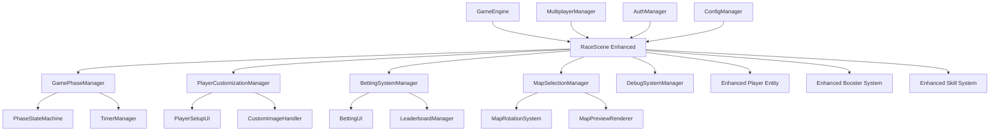

# Technical Design: Claudeweb Modularization

## Architecture Overview

The modularization transforms the 2,241-line claudeweb monolith into a properly structured system that integrates seamlessly with the existing src/ architecture. This design maintains 100% feature parity while improving performance, testability, and maintainability.



## Technology Stack

### Core Technologies (Existing)
- **Game Engine**: Phaser.js 3.60.0 for 2D rendering and physics
- **Build System**: Webpack 5.89.0 with existing configuration
- **Testing**: Jest 29.7.0 with existing test infrastructure
- **Multiplayer**: Socket.io 4.7.2 with existing multiplayer framework
- **Authentication**: Existing AuthManager and JWT-based system

### New Components Integration
- **State Management**: Enhanced GameEngine state management for racing phases
- **UI Framework**: Modular UI components extending existing UIManager
- **Asset Management**: Enhanced AssetManager for racing-specific assets
- **Performance Monitoring**: Integration with existing PerformanceMonitor

## Component Design

### Component: GamePhaseManager
- **Purpose**: Manages the four game phases (betting, racing, results, resetting) with precise timing
- **Interfaces**: 
  - `startPhase(phase: string, duration: number): void`
  - `getCurrentPhase(): GamePhase`
  - `getPhaseTimeRemaining(): number`
- **Dependencies**: TimerManager, GameEngine, MultiplayerManager

### Component: PlayerCustomizationManager
- **Purpose**: Handles player setup, name customization, and custom image uploads
- **Interfaces**:
  - `setupPlayer(index: number, config: PlayerConfig): Player`
  - `setCustomImage(playerId: string, imageData: string): Promise<boolean>`
  - `validateCustomImage(imageData: string): ValidationResult`
- **Dependencies**: Player entity, AssetManager, AuthManager

### Component: BettingSystemManager
- **Purpose**: Manages the complete betting system with odds, payouts, and leaderboard calculations
- **Interfaces**:
  - `initializeBetting(players: Player[]): void`
  - `placeBet(playerId: string, betAmount: number): BetResult`
  - `calculatePayouts(winnerData: WinnerData): PayoutResults`
  - `updateLeaderboard(results: GameResults): void`
- **Dependencies**: LeaderboardManager, MultiplayerManager, Player entities

### Component: MapSelectionManager
- **Purpose**: Handles map selection UI, rotation system, and map preview generation
- **Interfaces**:
  - `showMapSelection(): void`
  - `selectMap(mapId: string): void`
  - `getNextRotationMap(): string`
  - `generateMapPreview(mapId: string): HTMLCanvasElement`
- **Dependencies**: MapRotationManager, existing map generators, RenderManager

### Component: DebugSystemManager
- **Purpose**: Provides comprehensive debug information including heat maps and performance metrics
- **Interfaces**:
  - `toggleDebugMode(): void`
  - `updateDebugInfo(gameState: GameState): void`
  - `generateHeatMap(stuckEvents: StuckEvent[]): void`
  - `trackPerformanceMetrics(): PerformanceData`
- **Dependencies**: PerformanceMonitor, RenderManager, Player entities

## Data Model

### Enhanced Game State
```typescript
interface EnhancedGameState {
  // Core game state
  phase: 'betting' | 'racing' | 'results' | 'resetting';
  gameTime: number;
  bettingTime: number;
  raceNumber: number;
  
  // Map management
  currentMap: string;
  mapRotationCounter: number;
  availableMaps: MapConfig[];
  
  // Player state
  players: EnhancedPlayer[];
  customPlayerImages: Map<string, string>;
  playerBets: Map<string, BetData>;
  
  // Leaderboard
  leaderboardData: Map<string, PlayerStats>;
  sessionStats: GameSessionStats;
  
  // Debug information
  debugMode: boolean;
  performanceMetrics: PerformanceData;
  stuckEvents: StuckEvent[];
}
```

### Enhanced Player Entity
```typescript
interface EnhancedPlayer extends Player {
  // Existing player properties plus:
  customImage?: string;
  customName?: string;
  bettingData: {
    currentBet: number;
    totalWinnings: number;
    winRate: number;
  };
  debugInfo: {
    stuckCounter: number;
    lastPositions: Position[];
    performanceData: PlayerPerformanceData;
  };
}
```

### Betting System Data
```typescript
interface BettingSystemData {
  bets: Map<string, PlayerBet>;
  odds: Map<string, number>;
  totalPot: number;
  leaderboard: LeaderboardEntry[];
  payoutHistory: PayoutRecord[];
}

interface LeaderboardEntry {
  playerId: string;
  playerName: string;
  gamesPlayed: number;
  gamesWon: number;
  winRate: number;
  totalWinnings: number;
  rank: number;
}
```

## API Design

### Game Phase Management API
```typescript
class GamePhaseManager {
  // Phase transition methods
  async startBettingPhase(): Promise<void>
  async startRacingPhase(): Promise<void>
  async startResultsPhase(winner: Player): Promise<void>
  async startResettingPhase(): Promise<void>
  
  // Phase query methods
  getCurrentPhase(): GamePhase
  getPhaseTimeRemaining(): number
  isPhaseTransitionAllowed(newPhase: string): boolean
}
```

### Player Customization API
```typescript
class PlayerCustomizationManager {
  // Setup methods
  async setupPlayerCustomization(playerIndex: number): Promise<void>
  async setPlayerName(playerId: string, name: string): Promise<boolean>
  async setPlayerImage(playerId: string, imageData: string): Promise<boolean>
  
  // Validation methods
  validatePlayerName(name: string): ValidationResult
  validateCustomImage(imageData: string): ValidationResult
  
  // Persistence methods
  savePlayerCustomizations(): Promise<void>
  loadPlayerCustomizations(): Promise<void>
}
```

### Betting System API
```typescript
class BettingSystemManager {
  // Betting lifecycle
  initializeBettingPhase(players: Player[]): void
  placeBet(playerId: string, betAmount: number): BetResult
  closeBetting(): void
  
  // Results processing
  processRaceResults(winner: Player, raceData: RaceData): PayoutResults
  updateLeaderboard(results: GameResults): void
  
  // Query methods
  getBettingStatus(): BettingStatus
  getPlayerBets(): Map<string, PlayerBet>
  getLeaderboard(): LeaderboardEntry[]
}
```

## Integration Strategy

### Phase 1: Core System Integration
1. **GameEngine Enhancement**: Extend existing GameEngine to support racing-specific state management
2. **Scene Integration**: Enhance RaceScene to incorporate all claudeweb functionality
3. **Entity Enhancement**: Upgrade Player, Booster, and Skill entities with claudeweb features

### Phase 2: UI Component Modularization
1. **UI Manager Extension**: Create racing-specific UI components using existing UIManager patterns
2. **Component Development**: Build PlayerSetupUI, BettingUI, MapSelectionUI, and DebugUI components
3. **Styling Integration**: Integrate claudeweb CSS styling with existing game-ui.css

### Phase 3: System Manager Implementation
1. **Phase Management**: Implement GamePhaseManager with precise timing and state transitions
2. **Betting System**: Create comprehensive BettingSystemManager with full feature parity
3. **Debug System**: Implement advanced debug features with performance monitoring

### Phase 4: Performance and Security
1. **Performance Optimization**: Implement memory management, asset optimization, and 60 FPS targeting
2. **Security Implementation**: Add server-side validation and anti-cheat measures
3. **Testing Integration**: Comprehensive test suite following TDD principles

## Testing Strategy

### Unit Testing
- **Jest Configuration**: Extend existing Jest setup for racing-specific components
- **Mock Strategy**: Mock Phaser.js objects and multiplayer connections for isolated testing
- **Coverage Targets**: Achieve >80% coverage for all new components

### Integration Testing
- **Scene Testing**: Test complete racing scenes with full game lifecycle
- **Multiplayer Testing**: Validate multiplayer synchronization and betting system
- **Performance Testing**: Automated testing for 60 FPS and memory usage targets

### End-to-End Testing
- **Playwright Integration**: Extend existing E2E framework for racing game testing
- **User Journey Testing**: Complete betting-to-results workflow validation
- **Cross-browser Testing**: Ensure compatibility across target browsers

## Security Considerations

### Client-Side Security
- **Input Validation**: Comprehensive validation of all user inputs (names, images, bets)
- **Asset Validation**: Secure handling of custom player images with size and type restrictions
- **State Protection**: Prevent client-side manipulation of game state and betting data

### Server-Side Security
- **Action Validation**: Server-side validation of all player actions and game state changes
- **Anti-Cheat Measures**: Detection and prevention of common cheating patterns
- **Rate Limiting**: Protection against spam actions and malicious behavior

### Data Security
- **Secure Storage**: Encrypted storage of player data and betting information
- **Audit Logging**: Comprehensive logging of all game actions for security analysis
- **Privacy Protection**: GDPR-compliant handling of player data and custom images

## Performance Considerations

### Rendering Optimization
- **Sprite Batching**: Efficient rendering of multiple players and game objects
- **Texture Atlas**: Optimized sprite atlas for all racing-specific assets
- **Canvas Optimization**: Pixel-perfect rendering with hardware acceleration

### Memory Management
- **Asset Lifecycle**: Proper loading, caching, and disposal of game assets
- **Object Pooling**: Reuse of frequently created objects (boosters, particles, UI elements)
- **Memory Monitoring**: Real-time monitoring and automatic cleanup of memory leaks

### Network Optimization
- **State Synchronization**: Efficient multiplayer state updates with delta compression
- **Betting Optimization**: Batched betting updates to reduce network overhead
- **Asset Caching**: Client-side caching of frequently used assets and data

## Deployment Strategy

### Build Integration
- **Webpack Configuration**: Integration with existing webpack build process
- **Asset Pipeline**: Automated optimization and bundling of racing-specific assets
- **Environment Configuration**: Support for development, staging, and production environments

### CI/CD Integration
- **Automated Testing**: Integration with existing CI pipeline for automated test execution
- **Performance Monitoring**: Automated performance regression testing
- **Deployment Validation**: Automated validation of deployed functionality

### Monitoring and Observability
- **Performance Metrics**: Real-time monitoring of game performance and user engagement
- **Error Tracking**: Comprehensive error logging and alerting system
- **Analytics Integration**: Game analytics for betting patterns and player behavior

## Migration Plan

### Phase 1: Foundation (Week 1)
- Set up enhanced GameEngine and RaceScene structure
- Implement basic phase management and timing systems
- Create core entity enhancements

### Phase 2: Core Features (Week 2-3)
- Implement player customization system
- Build betting system with full functionality
- Create map selection and rotation system

### Phase 3: Advanced Features (Week 4)
- Implement debug system with heat maps and analytics
- Add performance optimization and memory management
- Integrate security and anti-cheat measures

### Phase 4: Production Ready (Week 5)
- Complete testing suite with full coverage
- Performance tuning and optimization
- Production deployment and monitoring setup

This design ensures seamless integration with the existing architecture while providing significant improvements in performance, maintainability, and functionality.