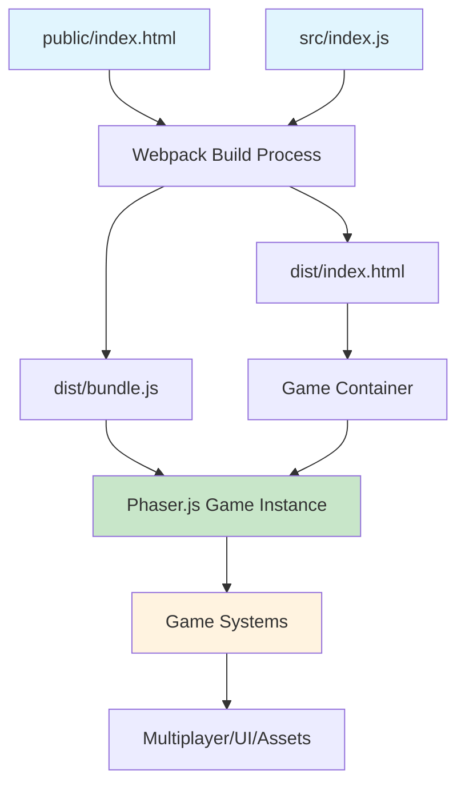
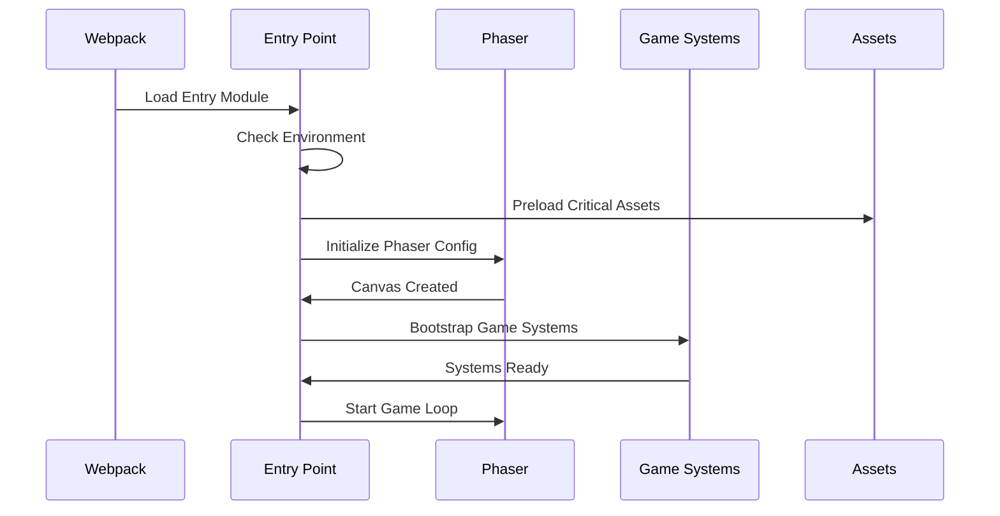

# Technical Design: Entry Point Files

## Architecture Overview
The entry point files serve as the foundation for the Memex Racing game's webpack-based build system. They provide the minimal HTML template and JavaScript entry point required to initialize the modular game architecture.



## Technology Stack
- **Build System**: Webpack 5.89.0 with existing configuration
- **Game Framework**: Phaser.js 3.60.0 for 2D pixel art rendering
- **Module System**: ES6 modules with webpack aliases
- **Development**: Hot Module Replacement for live reloading
- **Production**: Optimized bundles with code splitting

## Component Design

### Component: HTML Entry Point Template (public/index.html)
- **Purpose**: Minimal HTML template for webpack's HtmlWebpackPlugin
- **Interfaces**: Webpack template system, browser DOM
- **Dependencies**: None (static template)
- **Key Features**:
  - Responsive viewport configuration for pixel art
  - Game container element for Phaser.js canvas
  - Minimal structure for fast loading
  - Meta tags for game optimization

### Component: JavaScript Entry Point (src/index.js)
- **Purpose**: Main entry point for webpack bundling and game initialization
- **Interfaces**: Webpack module system, Phaser.js API, game modules
- **Dependencies**: Phaser.js, game engine modules, environment configuration
- **Key Features**:
  - Environment-aware initialization
  - Error boundary handling
  - Hot module replacement support
  - Modular game system bootstrapping

### Component: Environment Configuration System
- **Purpose**: Adaptive behavior based on development/production environment
- **Interfaces**: Webpack DefinePlugin, Node.js process.env
- **Dependencies**: Environment variables, game configuration
- **Key Features**:
  - Debug mode toggling
  - Performance optimization switches
  - Error reporting configuration
  - Asset loading strategies

## File Structure
```
project-root/
├── public/
│   ├── index.html          # HTML template for webpack
│   └── favicon.ico         # (existing, referenced in webpack)
├── src/
│   ├── index.js           # Main JavaScript entry point
│   ├── game/              # (existing) Game modules
│   ├── ui/                # (existing) UI components
│   ├── multiplayer/       # (existing) Network code
│   └── assets/            # (existing) Game assets
└── webpack.config.js      # (existing) Build configuration
```

## HTML Template Design

### Template Structure
The HTML template follows minimal design principles with focus on:
- Fast loading and rendering
- Proper viewport configuration for pixel art games
- Canvas-friendly container setup
- Webpack integration points

### Key Elements
- **Viewport Meta**: Ensures proper mobile rendering and pixel-perfect display
- **Game Container**: Dedicated div for Phaser.js canvas injection
- **Webpack Placeholders**: Title and favicon injection points
- **Performance Hints**: Preload and prefetch strategies

## JavaScript Entry Point Design

### Initialization Flow


### Module Structure
```javascript
// High-level structure (implementation details in tasks)
import gameConfig from './config/gameConfig';
import GameEngine from './game/engine/GameEngine';
import AssetManager from './systems/AssetManager';
import ErrorBoundary from './utils/ErrorBoundary';

// Environment-aware initialization
// Error boundary setup
// Asset preloading
// Game engine bootstrap
// Hot module replacement hooks
```

## Environment Configuration Strategy

### Development Mode Features
- **Debug Console**: Phaser debug mode enabled
- **Hot Reloading**: Webpack HMR with game state preservation
- **Verbose Logging**: Detailed game state and performance metrics
- **Developer Tools**: In-game debug overlays and controls

### Production Mode Features
- **Performance Optimization**: Minimized bundles and optimized assets
- **Error Reporting**: Robust error handling without debug information
- **Caching**: Aggressive caching strategies for assets and bundles
- **Security**: Hardened configuration without development tools

## Asset Integration Strategy

### Webpack Asset Pipeline
The entry point integrates with webpack's asset handling:
- **Static Assets**: Copied from src/assets/ to dist/assets/
- **Dynamic Imports**: Lazy loading for non-critical game assets
- **Data Files**: Configuration and presets from data/ folder
- **Chunk Splitting**: Separate bundles for vendor, Phaser, and game code

### Asset Loading Priorities
1. **Critical Path**: Core game engine and initial scene assets
2. **Preload**: Menu UI and common sprites
3. **Lazy Load**: Level-specific assets and music
4. **Background**: Optional enhancements and alternate content

## Performance Optimization

### Bundle Splitting Strategy
Based on existing webpack configuration:
- **Vendor Bundle**: Third-party libraries (optimized caching)
- **Phaser Bundle**: Game framework (separate for better caching)
- **Game Bundle**: Application code (frequent updates)
- **Runtime Bundle**: Webpack runtime (minimal, inlined)

### Loading Performance
- **Initial Bundle Size**: Target <200KB for core bundle
- **First Contentful Paint**: <1 second on standard connections
- **Game Ready Time**: <3 seconds total including asset preload
- **Memory Usage**: <50MB baseline before game content

## Error Handling Architecture

### Development Error Boundaries
- **Module Loading Errors**: Clear webpack resolution failures
- **Game Initialization**: Phaser configuration and canvas issues
- **Asset Loading**: Missing or corrupted game assets
- **Hot Reload**: State preservation during code changes

### Production Error Handling
- **Graceful Degradation**: Fallback behaviors for missing features
- **User-Friendly Messages**: Non-technical error reporting
- **Recovery Mechanisms**: Automatic retry and reload strategies
- **Logging**: Minimal error tracking without sensitive data

## Security Considerations

### Content Security Policy
- **Script Sources**: Self and webpack dev server only
- **Asset Sources**: Game assets from approved domains
- **Inline Scripts**: Minimal, hash-based allowlist
- **Eval Usage**: Restricted to development source maps

### Environment Variable Safety
- **Public Variables**: Version, build mode, API endpoints
- **Sensitive Data**: No secrets in client-side code
- **Injection Safety**: Proper escaping of dynamic content
- **Development Leaks**: Production builds exclude debug info

## Integration Points

### Webpack Configuration Compatibility
The entry files work seamlessly with existing webpack.config.js:
- **Entry Point**: src/index.js as configured
- **HTML Template**: public/index.html as configured
- **Aliases**: Full support for @game, @ui, @assets shortcuts
- **Asset Rules**: Compatible with existing file type handling

### Game Module Integration
- **Engine Bootstrap**: Initialize game engine with proper configuration
- **Scene Management**: Connect to existing scene architecture
- **System Loading**: Bootstrap multiplayer, UI, and asset systems
- **Error Propagation**: Integrate with existing error handling patterns

## Development Workflow

### Hot Module Replacement
- **Game State Preservation**: Maintain game state across code changes
- **Asset Hot Reload**: Update sprites and sounds without restart
- **Configuration Changes**: Apply game config changes dynamically
- **Scene Reload**: Restart current scene without full reload

### Debug Integration
- **Console Commands**: Expose game state manipulation
- **Visual Debugging**: Overlay information and controls
- **Performance Monitoring**: Real-time FPS and memory usage
- **Network Debugging**: WebSocket connection status and logs

## Testing Strategy

### Unit Testing
- **Entry Point Logic**: Environment detection and configuration
- **Error Boundaries**: Proper error catching and reporting
- **Asset Loading**: Preload behavior and fallback handling
- **Module Resolution**: Webpack alias and import verification

### Integration Testing
- **Webpack Build**: Successful bundle generation
- **Game Initialization**: Phaser game instance creation
- **Asset Pipeline**: Asset copying and resolution
- **Development Server**: Hot reload and dev server functionality

### Browser Testing
- **Cross-Browser**: Chrome, Firefox, Safari, Edge compatibility
- **Mobile Support**: Touch controls and responsive design
- **Performance**: Loading times and runtime performance
- **Error Scenarios**: Network failures and missing assets

## Monitoring and Maintenance

### Build Metrics
- **Bundle Size**: Track bundle size changes over time
- **Build Time**: Monitor webpack compilation performance
- **Asset Optimization**: Compression and caching effectiveness
- **Dependency Analysis**: Third-party library impact

### Runtime Monitoring
- **Loading Performance**: Time to interactive measurements
- **Error Rates**: Client-side error frequency and types
- **Asset Loading**: Success rates and load times
- **Game Performance**: FPS and memory usage patterns

## Migration and Compatibility

### Backward Compatibility
- **Existing Code**: No changes required to existing game modules
- **Asset Paths**: Maintained compatibility with current asset structure
- **Configuration**: Works with existing webpack and package.json setup
- **Dependencies**: No new dependencies required

### Future Extensibility
- **Module Federation**: Prepared for micro-frontend architecture
- **Progressive Web App**: Foundation for PWA implementation
- **Server-Side Rendering**: Architecture supports SSR addition
- **Build System**: Flexible for future webpack upgrades