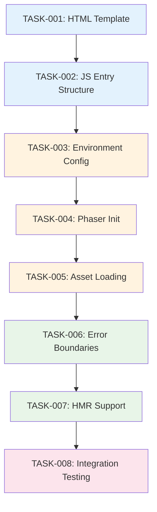

# Implementation Plan: Entry Point Files

## Task Summary
Total Tasks: 8
Estimated Effort: 1.5 days

## Task Breakdown

### TASK-001: Create HTML Entry Point Template
- **Status**: ⏳ pending
- **Description**: Create public/index.html as the webpack HTML template with proper viewport and game container setup
- **Expected Output**:
  - File: public/index.html
  - Minimal HTML structure with game container
  - Proper viewport meta tags for pixel art rendering
  - Webpack template placeholders for title and favicon
- **TDD Process**:
  1. Write test to verify HTML template structure and required elements
  2. Create minimal public/index.html with viewport and game container
  3. Refactor for optimal loading and webpack integration
- **Acceptance Test**:
  ```gherkin
  Given the HTML template exists at public/index.html
  When webpack processes the template
  Then the HTML should contain viewport meta tag
  And the HTML should contain game container div
  And webpack should inject title and scripts correctly
  ```
- Dependencies: None
- Estimated Time: 2 hours

### TASK-002: Create JavaScript Entry Point Module Structure
- **Status**: ⏳ pending
- **Description**: Create src/index.js as the main webpack entry point with basic module structure and imports
- **Expected Output**:
  - File: src/index.js
  - Module imports for game systems
  - Basic initialization function structure
  - Environment detection capability
- **TDD Process**:
  1. Write test to verify module exports and basic structure
  2. Create src/index.js with module imports and initialization stub
  3. Refactor for proper separation of concerns and error handling
- **Acceptance Test**:
  ```gherkin
  Given src/index.js exists as the entry point
  When webpack processes the module
  Then all imports should resolve without errors
  And the module should export initialization function
  And environment variables should be accessible
  ```
- Dependencies: TASK-001
- Estimated Time: 1.5 hours

### TASK-003: Implement Environment Configuration System
- **Status**: ⏳ pending
- **Description**: Add environment-aware configuration handling in the entry point
- **Expected Output**:
  - Environment detection logic (development vs production)
  - Configuration objects for each environment
  - Debug mode toggle implementation
  - Error reporting configuration
- **TDD Process**:
  1. Write tests for environment detection and configuration objects
  2. Implement environment detection using process.env.NODE_ENV
  3. Refactor configuration to use proper defaults and overrides
- **Acceptance Test**:
  ```gherkin
  Given NODE_ENV is set to development
  When the game initializes
  Then debug features should be enabled
  And verbose logging should be active
  
  Given NODE_ENV is set to production
  When the game initializes
  Then performance optimizations should be enabled
  And minimal logging should be active
  ```
- Dependencies: TASK-002
- Estimated Time: 2 hours

### TASK-004: Implement Phaser.js Game Initialization
- **Status**: ⏳ pending
- **Description**: Add Phaser.js game instance creation and configuration in entry point
- **Expected Output**:
  - Phaser game configuration object
  - Game instance creation logic
  - Canvas container integration
  - Basic error handling for game initialization
- **TDD Process**:
  1. Write tests for Phaser config generation and game instance creation
  2. Implement minimal Phaser game initialization with test scene
  3. Refactor to use environment-specific configuration
- **Acceptance Test**:
  ```gherkin
  Given the entry point initializes
  When Phaser.js game is created
  Then the game canvas should be injected into game container
  And the game should use environment-appropriate configuration
  And no initialization errors should occur
  ```
- Dependencies: TASK-003
- Estimated Time: 2.5 hours

### TASK-005: Implement Asset Loading Integration
- **Status**: ⏳ pending
- **Description**: Add asset preloading and webpack asset integration to entry point
- **Expected Output**:
  - Asset path resolution for webpack
  - Critical asset preloading logic
  - Integration with existing src/assets structure
  - Error handling for missing assets
- **TDD Process**:
  1. Write tests for asset path resolution and preloading behavior
  2. Implement basic asset loading with webpack require context
  3. Refactor to optimize loading priority and error recovery
- **Acceptance Test**:
  ```gherkin
  Given assets exist in src/assets/
  When the game initializes
  Then webpack should resolve asset paths correctly
  And critical assets should be preloaded
  And missing assets should not crash the game
  ```
- Dependencies: TASK-004
- Estimated Time: 2 hours

### TASK-006: Implement Error Boundary System
- **Status**: ⏳ pending
- **Description**: Add comprehensive error handling and boundary system to entry point
- **Expected Output**:
  - Error boundary wrapper for game initialization
  - Environment-specific error reporting
  - Graceful fallback behaviors
  - User-friendly error messages
- **TDD Process**:
  1. Write tests for error catching and reporting in different scenarios
  2. Implement basic error boundary with try-catch and error event handlers
  3. Refactor to provide appropriate error messaging per environment
- **Acceptance Test**:
  ```gherkin
  Given an error occurs during game initialization
  When the error boundary catches it
  Then the error should be handled gracefully
  And appropriate error message should be displayed
  And the application should not crash completely
  ```
- Dependencies: TASK-005
- Estimated Time: 2 hours

### TASK-007: Implement Hot Module Replacement Support
- **Status**: ⏳ pending
- **Description**: Add HMR hooks and game state preservation for development workflow
- **Expected Output**:
  - HMR accept hooks in entry point
  - Game state preservation logic
  - Module reload handling
  - Development-only HMR code
- **TDD Process**:
  1. Write tests for HMR hook registration and state preservation
  2. Implement basic HMR acceptance with module.hot API
  3. Refactor to preserve relevant game state across reloads
- **Acceptance Test**:
  ```gherkin
  Given the development server is running with HMR
  When source files are modified
  Then the application should hot-reload
  And relevant game state should be preserved
  And the game should continue functioning normally
  ```
- Dependencies: TASK-006
- Estimated Time: 2 hours

### TASK-008: Integration Testing and Webpack Compatibility
- **Status**: ⏳ pending
- **Description**: Verify complete integration with existing webpack configuration and build process
- **Expected Output**:
  - Successful webpack builds in development and production
  - Proper bundle splitting and optimization
  - Asset copying and resolution verification
  - Cross-browser compatibility testing
- **TDD Process**:
  1. Write integration tests for webpack build process and bundle output
  2. Test complete build pipeline with different NODE_ENV values
  3. Refactor any compatibility issues with existing webpack configuration
- **Acceptance Test**:
  ```gherkin
  Given the entry point files are implemented
  When webpack builds the project
  Then the build should complete without errors
  And all bundles should be generated correctly
  And the game should load and run in the browser
  
  Given the production build is generated
  When the game loads in the browser
  Then performance should meet requirements
  And no development-only code should be included
  ```
- Dependencies: TASK-007
- Estimated Time: 2 hours

## Task Dependencies Visualization



## Implementation Strategy

### Phase 1: Foundation (TASK-001 to TASK-003)
Create the basic structure and configuration system that everything else builds upon. Focus on getting webpack to recognize and process the entry files correctly.

### Phase 2: Game Integration (TASK-004 to TASK-005)
Integrate with Phaser.js and the asset system to create a working game initialization pipeline.

### Phase 3: Robustness (TASK-006 to TASK-007)
Add error handling and development tools to make the system production-ready and developer-friendly.

### Phase 4: Validation (TASK-008)
Comprehensive testing to ensure everything works together with the existing codebase and webpack configuration.

## Quality Checkpoints

After each task completion:
1. **Webpack Build**: Verify successful build without errors
2. **Browser Loading**: Test game loading in development browser
3. **Code Quality**: Ensure proper error handling and clean code
4. **Integration**: Verify compatibility with existing project structure

## Risk Mitigation

### Potential Issues:
- **Webpack Compatibility**: Existing configuration may need adjustments
- **Asset Resolution**: Complex asset paths might not resolve correctly
- **Phaser Integration**: Game engine initialization might conflict with HMR
- **Environment Variables**: Production builds might expose development settings

### Mitigation Strategies:
- Test with existing webpack configuration early and often
- Use incremental development with frequent browser testing
- Implement fallback behaviors for all critical functionality
- Separate development and production code paths clearly

## Success Criteria

The implementation is complete when:
1. **Development Build**: `npm run dev` starts the game successfully
2. **Production Build**: `npm run build` generates optimized bundles
3. **Game Loading**: Game initializes within 3 seconds on standard connections
4. **Hot Reload**: Code changes reload the game within 2 seconds
5. **Error Handling**: Graceful degradation for common error scenarios
6. **Cross-Browser**: Game works in Chrome, Firefox, Safari, and Edge
7. **Asset Integration**: All existing assets load correctly
8. **Webpack Compatibility**: No modifications needed to existing webpack.config.js