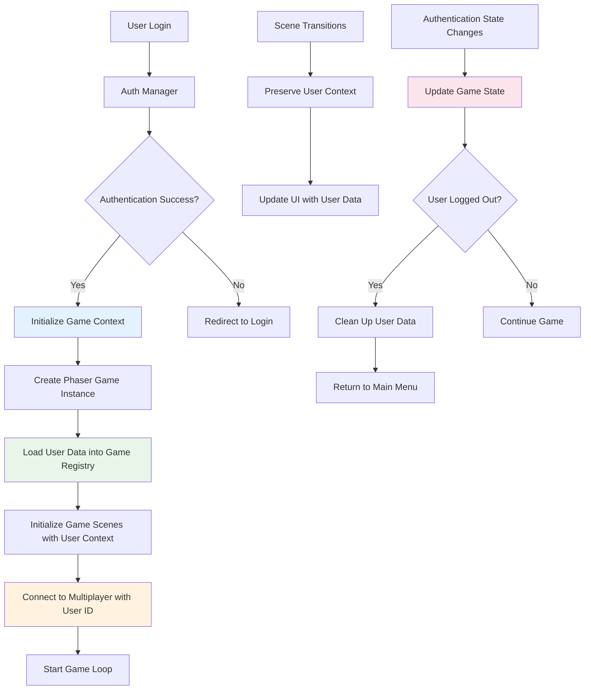

# Technical Design: Game Engine Integration

## Architecture Overview

The Game Engine Integration connects the completed authentication system with the Phaser.js game engine, enabling authenticated users to seamlessly access and play the game. This integration establishes a secure, performant bridge between authentication state and game functionality.



## Technology Stack Integration

### Existing Components
- **Authentication**: Complete system with JWT tokens, secure storage, CSRF protection
- **Game Engine**: Phaser.js 3.x with scene management and physics
- **UI System**: React-like component system for game UI
- **Multiplayer**: Socket.io based real-time communication
- **Asset Management**: Comprehensive asset loading and caching system

### New Integration Layer
- **Authentication Bridge**: Connects auth state to Phaser game registry
- **Context Propagation**: Ensures user data flows through all game scenes
- **State Synchronization**: Keeps auth and game states consistent
- **Error Integration**: Extends existing error boundaries for auth failures

## Component Design

### AuthGameBridge Component
**Purpose**: Central integration point between authentication and game systems
**Location**: `src/game/systems/AuthGameBridge.js`

```javascript
class AuthGameBridge {
  constructor(game, authManager) {
    this.game = game;
    this.authManager = authManager;
    this.userContext = null;
    this.isInitialized = false;
  }

  async initializeUserContext(userData) {
    // Validate and sanitize user data
    // Store in Phaser game registry
    // Propagate to all active scenes
    // Initialize multiplayer connection
  }

  updateAllScenes(userData) {
    // Update each scene's user context
    // Refresh UI components
    // Update multiplayer state
  }

  handleAuthStateChange(newState) {
    // React to login/logout events
    // Clean up or initialize as needed
    // Maintain game state consistency
  }
}
```

**Interfaces**:
- `initializeUserContext(userData)`: Sets up game with user data
- `updateAllScenes(userData)`: Propagates user changes to scenes
- `handleAuthStateChange(state)`: Responds to authentication events
- `cleanupUserContext()`: Removes user data on logout

**Dependencies**: AuthManager, Phaser Game instance, MultiplayerManager

### Enhanced LoginIntegration Module
**Purpose**: Extended integration with Phaser-specific functionality
**Location**: `src/auth/login-integration.js` (enhanced)

```javascript
// New methods to add:
async integrateWithPhaserScenes(game) {
  // Enhanced scene integration
  // Context propagation setup
  // Error boundary registration
}

setupGameStateHandlers(game) {
  // Handle game-specific auth events
  // Manage scene transitions
  // Update multiplayer connections
}

validateGameAccess(requiredPermissions = []) {
  // Check if user can access specific game features
  // Validate session before game actions
  // Handle permission-based access control
}
```

### Scene Enhancement Pattern
**Purpose**: Standardized user context access across all game scenes
**Location**: All scene files in `src/game/scenes/`

```javascript
class EnhancedGameScene extends Phaser.Scene {
  create() {
    // Get user context from game registry
    this.userContext = this.registry.get('userContext');
    this.isAuthenticated = this.registry.get('isAuthenticated');
    
    // Setup user-specific content
    if (this.userContext) {
      this.setupUserSpecificContent();
    }
    
    // Listen for auth state changes
    this.registry.events.on('auth-state-changed', this.handleAuthChange, this);
  }

  setupUserSpecificContent() {
    // Display user name, level, statistics
    // Load user preferences
    // Configure user-specific game settings
  }

  handleAuthChange(newState) {
    // React to auth changes during gameplay
    // Update UI elements
    // Manage access to features
  }
}
```

## Data Model

### User Game Context
```javascript
const UserGameContext = {
  // Core user information
  id: 'string', // Unique user identifier
  username: 'string', // Display name
  email: 'string', // User email (optional in game)
  
  // Game-specific data
  statistics: {
    level: 'number', // Player level
    totalPoints: 'number', // Accumulated points
    wins: 'number', // Race victories
    losses: 'number', // Race defeats
    gamesPlayed: 'number', // Total races
    winRate: 'number', // Win percentage
    bestTime: 'number', // Best race time in ms
    totalPlayTime: 'number' // Total time played
  },
  
  // Game preferences
  preferences: {
    soundEnabled: 'boolean',
    musicVolume: 'number', // 0-1
    effectsVolume: 'number', // 0-1
    playerColor: 'string', // Preferred player color
    controlScheme: 'string', // Input preferences
    displayName: 'string' // Custom display name
  },
  
  // Session data
  session: {
    loginTime: 'Date', // When user logged in
    lastActivity: 'Date', // Last game action
    currentRoom: 'string', // Current multiplayer room
    gameState: 'object' // Current game progress
  },
  
  // Authentication data
  auth: {
    token: 'string', // JWT token (handled securely)
    permissions: 'array', // User permissions
    roles: 'array', // User roles
    expiresAt: 'Date' // Token expiration
  }
};
```

### Authentication Event Model
```javascript
const AuthEvents = {
  LOGIN_SUCCESS: 'auth:login:success',
  LOGIN_FAILURE: 'auth:login:failure',
  LOGOUT: 'auth:logout',
  TOKEN_REFRESH: 'auth:token:refresh',
  SESSION_EXPIRED: 'auth:session:expired',
  PERMISSIONS_CHANGED: 'auth:permissions:changed'
};
```

## API Design

### Authentication Bridge API
```javascript
// Initialize integration
await AuthGameBridge.initialize(game, authManager);

// User context management
const userContext = AuthGameBridge.getUserContext();
AuthGameBridge.updateUserContext(newData);
AuthGameBridge.clearUserContext();

// Scene integration
AuthGameBridge.propagateToScene(sceneName, userData);
AuthGameBridge.setupSceneAuth(scene);

// Event handling
AuthGameBridge.on('user-login', callback);
AuthGameBridge.on('user-logout', callback);
AuthGameBridge.on('auth-error', callback);
```

### Enhanced Scene API
```javascript
// In any game scene
class MyGameScene extends Phaser.Scene {
  create() {
    // Get authenticated user
    const user = this.getAuthenticatedUser();
    
    // Check permissions
    if (this.requireAuth(['play_multiplayer'])) {
      // User has multiplayer permissions
    }
    
    // Update user stats
    this.updateUserStats({ points: 100 });
    
    // Handle auth events
    this.onAuthStateChange((newState) => {
      // React to auth changes
    });
  }
}
```

## Implementation Strategy

### Phase 1: Core Integration (2 hours)
1. **Create AuthGameBridge**: Central integration component
2. **Enhance LoginIntegration**: Add Phaser-specific methods
3. **Update Game Initialization**: Integrate auth check in main index.js
4. **Test Basic Flow**: Ensure login leads to game initialization

### Phase 2: Scene Context Propagation (3 hours)
1. **Update All Scenes**: Add user context access patterns
2. **Create Scene Base Class**: Standardize authentication handling
3. **Implement Context Updates**: Handle auth state changes during gameplay
4. **Test Scene Transitions**: Verify user data persists across scenes

### Phase 3: Error Handling Integration (2 hours)
1. **Extend Error Boundaries**: Cover authentication failures
2. **Add Recovery Mechanisms**: Handle session expiration gracefully
3. **Implement Retry Logic**: Auto-reconnect on network issues
4. **Test Error Scenarios**: Verify graceful degradation

### Phase 4: Performance Optimization (1 hour)
1. **Optimize Context Updates**: Minimize performance impact
2. **Cache User Data**: Reduce repeated auth checks
3. **Profile Integration**: Ensure 60 FPS maintained
4. **Load Testing**: Verify performance under load

## Security Considerations

### Token Security
- JWT tokens stored securely in AuthManager, never exposed to game logic
- Token validation occurs in secure contexts only
- Automatic token refresh before expiration
- Secure transmission of authentication data

### Data Sanitization
- All user data sanitized before use in game context
- XSS prevention for user-generated content (usernames, preferences)
- SQL injection prevention for server-side operations
- Input validation for all user preferences and statistics

### Session Management
- Session timeouts properly handled during gameplay
- Automatic cleanup of user data on logout
- Prevention of session hijacking through proper token management
- Audit logging for authentication events

### Permission Validation
- Role-based access control for game features
- Permission checks before sensitive operations
- Graceful degradation for insufficient permissions
- Regular permission validation during extended gameplay

## Performance Considerations

### Expected Load
- **Authentication Checks**: 1-2 per scene transition
- **Context Updates**: 5-10 per minute during active gameplay
- **Token Validation**: 1 per server request (multiplayer actions)
- **State Synchronization**: Continuous during multiplayer games

### Optimization Strategies
- **Context Caching**: Cache user data in Phaser registry to avoid repeated auth calls
- **Lazy Loading**: Load non-critical user data in background
- **Event Batching**: Batch auth state updates to reduce processing overhead
- **Memory Management**: Proper cleanup of auth data on scene destruction

### Performance Targets
- **Game Initialization**: No more than 100ms added for auth integration
- **Scene Transitions**: Complete within 500ms including auth context setup
- **Frame Rate**: Maintain 60 FPS during all auth operations
- **Memory Usage**: Auth context limited to 5MB maximum

## Testing Strategy

### Unit Tests
- **AuthGameBridge**: All integration methods and error handling
- **Enhanced Scenes**: User context access and auth state changes
- **LoginIntegration**: Phaser-specific integration methods
- **Error Boundaries**: Authentication error handling and recovery

### Integration Tests
- **Login Flow**: Complete authentication to game initialization
- **Scene Transitions**: User context preservation across scenes
- **Multiplayer Integration**: Authenticated multiplayer connections
- **Error Recovery**: Session expiration and reconnection handling

### End-to-End Tests
- **Complete User Journey**: Login to gameplay to logout
- **Multi-Session Testing**: Multiple users in same game
- **Network Failure Testing**: Authentication during connectivity issues
- **Performance Testing**: Auth integration under game load

### BDD Test Scenarios
```gherkin
Feature: Authentication Game Integration
  Scenario: Successful login leads to game
    Given a user with valid credentials
    When they log in successfully
    Then the game should initialize with their profile
    And all scenes should have access to user data
    And multiplayer should connect with their user ID

  Scenario: Session expiration during gameplay
    Given a user is playing the game
    When their session expires
    Then the game should pause gracefully
    And they should be prompted to re-authenticate
    And their progress should be preserved
```

## Risk Mitigation

### Authentication Server Downtime
- **Offline Mode**: Allow basic gameplay without authentication
- **Grace Period**: Extended session timeouts during server issues
- **Fallback UI**: Clear messaging about authentication status
- **Auto-Retry**: Automatic reconnection attempts with exponential backoff

### Token Expiration During Gameplay
- **Proactive Refresh**: Refresh tokens before expiration
- **Seamless Renewal**: Background token renewal without interrupting gameplay
- **Pause Mechanism**: Graceful game pause for required re-authentication
- **Progress Preservation**: Save game state before authentication operations

### Performance Degradation
- **Performance Monitoring**: Real-time FPS and memory monitoring
- **Circuit Breaker**: Disable auth features if performance drops
- **Optimization Fallbacks**: Reduce auth checks frequency if needed
- **Resource Limits**: Strict memory limits for auth context data

## Success Metrics

### Functional Success
- **100% Auth Integration**: All game features work with authentication
- **Zero Data Loss**: No user progress lost during auth operations
- **Complete Error Handling**: All auth errors handled gracefully
- **Session Continuity**: Seamless user experience across auth state changes

### Performance Success
- **<100ms Initialization**: Auth integration adds minimal game startup time
- **60 FPS Maintained**: No frame rate impact from auth operations
- **<5MB Memory**: Auth context uses minimal memory resources
- **<500ms Transitions**: Scene changes complete quickly with auth context

### Security Success
- **Zero Token Exposure**: No authentication tokens visible in game context
- **Secure Data Flow**: All user data properly sanitized and validated
- **Permission Compliance**: All game features respect user permissions
- **Audit Trail**: Complete logging of authentication events