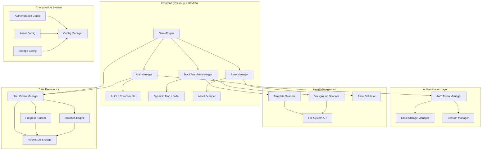

# Technical Design: Multi-Phase Game Enhancement

## Architecture Overview

The enhancement will integrate three major systems into the existing modular Memex Racing architecture: dynamic asset loading, user authentication, and progress tracking. The design maintains the current modular structure while adding new authentication and storage layers.



## Technology Stack

### Core Technologies
- **Game Engine**: Phaser.js 3.60+ for 2D rendering and physics
- **Frontend**: HTML5 Canvas with ES6+ JavaScript modules
- **Module System**: ES6 imports with webpack bundling
- **Authentication**: JWT tokens with secure local storage
- **Data Storage**: IndexedDB for client-side persistence
- **Asset Loading**: Dynamic file system scanning with validation
- **Testing**: Jest for unit tests, Playwright for integration

### New Dependencies
```json
{
  "jsonwebtoken": "^9.0.2",
  "bcryptjs": "^2.4.3", 
  "idb": "^7.1.1",
  "crypto-js": "^4.2.0",
  "joi": "^17.11.0",
  "fast-glob": "^3.3.2"
}
```

### Development Tools
- **Hot Reload**: Webpack dev server with HMR support
- **Validation**: JSON Schema validation for configurations
- **Security**: OWASP security practices for token management
- **Performance**: LRU caching and memory optimization

## Component Design

### 1. Authentication System (`src/auth/`)

#### AuthManager Class
```javascript
class AuthManager {
  constructor(gameEngine, config = {})
  async initialize()
  async login(credentials)
  async register(userData)
  async logout()
  async refreshToken()
  isAuthenticated()
  getCurrentUser()
  getAuthToken()
  onAuthStateChange(callback)
}
```

**Purpose**: Central authentication controller managing all auth operations
**Interfaces**: 
- GameEngine integration via event system
- JWT token management with automatic refresh
- Secure storage interface for credentials
**Dependencies**: JWTManager, StorageManager, AuthUI

#### JWTManager Class
```javascript
class JWTManager {
  constructor(config)
  generateToken(userData)
  validateToken(token)
  refreshToken(refreshToken)
  extractUserData(token)
  isTokenExpired(token)
  scheduleTokenRefresh(token)
}
```

**Purpose**: Handle JWT token lifecycle and validation
**Security**: RS256 algorithm, configurable expiration, automatic refresh

#### StorageManager Class
```javascript
class StorageManager {
  constructor(config)
  async storeCredentials(credentials)
  async getCredentials()
  async clearCredentials()
  async storeUserData(userData)
  async getUserData()
  isStorageAvailable()
  encrypt(data)
  decrypt(data)
}
```

**Purpose**: Secure local storage with encryption for sensitive data
**Storage**: IndexedDB for structured data, localStorage for tokens with AES encryption

### 2. Enhanced Asset System

#### TrackTemplateManager Updates
```javascript
// New methods to add
async scanRealAssets()
async loadTemplateFromFile(filePath)
async loadBackgroundFromFile(filePath)
validateAssetFormat(asset, type)
createAssetMetadata(filePath, asset)
```

**Enhancement**: Replace mock data with actual file system scanning
**Validation**: Check for white pixel tracks, support JPEG/PNG formats
**Fallback**: Graceful degradation to mock data if scanning fails

#### AssetScanner Class (New)
```javascript
class AssetScanner {
  constructor(assetManager)
  async scanDirectory(path, pattern)
  async validateAssetFile(filePath, expectedFormat)
  generateAssetMetadata(filePath, stats)
  watchForChanges(path, callback)
}
```

**Purpose**: Dynamic asset discovery and monitoring
**Features**: File system scanning, metadata generation, hot reload support

### 3. User Progress System

#### UserProfileManager Class (New)
```javascript
class UserProfileManager {
  constructor(authManager, storageManager)
  async createProfile(userData)
  async updateProfile(updates)
  async getProfile(userId)
  async updateStatistics(raceResult)
  async getLeaderboard()
  async syncProgress()
  calculateUserRanking(stats)
}
```

**Purpose**: Manage user profiles and persistent statistics
**Data Model**: User profiles, race history, achievements, preferences

#### ProgressTracker Class (New)
```javascript
class ProgressTracker {
  constructor(profileManager)
  async recordRaceResult(result)
  async updateAchievements(userId, raceData)
  async getProgressHistory(userId, timeframe)
  calculateWinRate(userId)
  getPerformanceTrends(userId)
}
```

**Purpose**: Track user progress and generate statistics

### 4. Authentication UI Components

#### AuthUI Class (New)
```javascript
class AuthUI {
  constructor(authManager, gameEngine)
  showLoginScreen()
  showRegistrationForm()
  showProfilePanel()
  validateFormData(formData)
  displayAuthErrors(errors)
  handleFormSubmission(formType, data)
}
```

**Purpose**: Manage authentication user interface
**Integration**: Phaser scene overlay system for seamless UI

## Data Models and Storage Design

### User Profile Schema
```javascript
const UserProfileSchema = {
  id: "string (UUID)",
  username: "string (unique, 3-20 chars)",
  email: "string (validated email format)",
  passwordHash: "string (bcrypt hash)",
  createdAt: "timestamp",
  lastLogin: "timestamp",
  preferences: {
    theme: "string",
    notifications: "boolean",
    autoLogin: "boolean"
  },
  statistics: {
    totalRaces: "number",
    wins: "number",
    losses: "number",
    winRate: "number (calculated)",
    averagePosition: "number",
    bestTime: "number",
    totalPlayTime: "number",
    achievementPoints: "number"
  },
  gameData: {
    currentStreak: "number",
    longestStreak: "number",
    favoriteMap: "string",
    customizations: "object"
  }
}
```

### Race Result Schema
```javascript
const RaceResultSchema = {
  id: "string (UUID)",
  userId: "string (UUID)",
  raceId: "string (UUID)",
  timestamp: "timestamp",
  mapName: "string",
  position: "number (1-6)",
  raceTime: "number (seconds)",
  players: "array of player data",
  events: "array of race events",
  statistics: {
    boostersCollected: "number",
    skillsUsed: "number",
    collisions: "number",
    distanceTraveled: "number"
  }
}
```

### Configuration Schema
```javascript
const AuthConfigSchema = {
  jwt: {
    secret: "string (environment variable)",
    algorithm: "string (default: HS256)",
    expiresIn: "string (default: 24h)",
    refreshExpiresIn: "string (default: 7d)"
  },
  password: {
    minLength: "number (default: 8)",
    requireSpecialChars: "boolean (default: true)",
    requireNumbers: "boolean (default: true)",
    requireUppercase: "boolean (default: true)"
  },
  session: {
    rememberMe: "boolean (default: true)",
    maxSessions: "number (default: 5)",
    sessionTimeout: "number (default: 86400)"
  },
  storage: {
    encryptLocalData: "boolean (default: true)",
    clearOnLogout: "boolean (default: true)",
    syncInterval: "number (default: 300000)"
  }
}
```

## API Design

### Authentication Endpoints (Client-side API)
```javascript
// AuthManager public interface
POST /auth/login
  Request: { username: string, password: string, rememberMe?: boolean }
  Response: { success: boolean, token: string, user: UserProfile, expiresIn: number }

POST /auth/register  
  Request: { username: string, email: string, password: string, confirmPassword: string }
  Response: { success: boolean, token: string, user: UserProfile }

POST /auth/refresh
  Request: { refreshToken: string }
  Response: { success: boolean, token: string, expiresIn: number }

POST /auth/logout
  Request: { token: string }
  Response: { success: boolean }

GET /auth/profile
  Request: Headers: { Authorization: "Bearer <token>" }
  Response: { success: boolean, user: UserProfile }
```

### Asset Management API
```javascript
// TrackTemplateManager enhanced interface
GET /assets/templates
  Response: { templates: Array<TemplateMetadata> }

GET /assets/backgrounds  
  Response: { backgrounds: Array<BackgroundMetadata> }

POST /assets/validate
  Request: { assetPath: string, assetType: string }
  Response: { valid: boolean, metadata: AssetMetadata, errors?: Array<string> }
```

### Progress Tracking API
```javascript
// UserProfileManager interface
GET /progress/profile/:userId
  Response: { profile: UserProfile, statistics: UserStatistics }

POST /progress/race-result
  Request: { raceResult: RaceResult }
  Response: { success: boolean, updatedStats: UserStatistics }

GET /progress/leaderboard
  Query: { timeframe?: string, limit?: number }
  Response: { leaderboard: Array<LeaderboardEntry> }

GET /progress/history/:userId
  Query: { timeframe?: string, limit?: number }
  Response: { history: Array<RaceResult> }
```

## Security Considerations

### Authentication Security
- **Password Security**: bcrypt hashing with salt rounds ≥ 12
- **JWT Security**: RS256 signing, short-lived access tokens (24h), long-lived refresh tokens (7d)
- **Token Storage**: AES-256 encryption for local storage, secure HTTPOnly cookies for server deployment
- **CSRF Protection**: SameSite cookie attributes, CSRF tokens for state-changing operations
- **Brute Force Protection**: Rate limiting, account lockout after failed attempts

### Data Protection
- **Local Storage Encryption**: AES-256-GCM for sensitive data
- **Input Validation**: Joi schema validation for all user inputs
- **XSS Prevention**: Content Security Policy, input sanitization
- **Data Integrity**: Checksum validation for stored user data

### Privacy Compliance
- **Data Minimization**: Store only essential user data
- **Consent Management**: Clear opt-in for data collection
- **Data Retention**: Configurable data retention policies
- **Export/Delete**: User data export and account deletion features

## Performance Optimization Strategies

### Asset Loading Performance
- **Lazy Loading**: Load assets on-demand with priority queues
- **Caching Strategy**: LRU cache with configurable size limits
- **Compression**: WebP format support, sprite sheet optimization
- **Preloading**: Critical assets loaded during splash screen
- **Memory Management**: Automatic cleanup of unused assets

### Authentication Performance
- **Token Caching**: In-memory token caching with automatic cleanup
- **Background Refresh**: Proactive token renewal before expiration
- **Session Persistence**: Efficient session restoration on app startup
- **Batch Operations**: Group related auth operations to reduce overhead

### Storage Performance
- **IndexedDB Optimization**: Proper indexing for frequent queries
- **Data Compression**: LZ4 compression for large datasets
- **Lazy Synchronization**: Background sync of non-critical data
- **Cache Invalidation**: Smart cache invalidation based on data freshness

### Game Performance
- **Asset Validation**: Async validation without blocking gameplay
- **Memory Monitoring**: Automatic memory cleanup when thresholds exceeded
- **Background Processing**: Move heavy operations to Web Workers
- **Frame Rate Targets**: Maintain 60 FPS during authentication operations

## Testing Approach

### Unit Testing Strategy
```javascript
// Authentication System Tests
describe('AuthManager', () => {
  test('should authenticate valid credentials')
  test('should reject invalid credentials')
  test('should handle token expiration gracefully')
  test('should persist user session correctly')
})

// Asset Loading Tests  
describe('TrackTemplateManager', () => {
  test('should scan and load real template assets')
  test('should fallback to mock data on scan failure')
  test('should validate asset formats correctly')
  test('should handle mixed JPEG/PNG backgrounds')
})

// Progress Tracking Tests
describe('UserProfileManager', () => {
  test('should create user profiles with correct schema')
  test('should update statistics after race completion')
  test('should calculate win rates accurately')
  test('should handle offline/online sync correctly')
})
```

### Integration Testing
- **Authentication Flow**: Complete login/register/logout cycles
- **Asset Pipeline**: Full asset loading and validation pipeline
- **Game Integration**: Authentication + gameplay interaction
- **Storage Persistence**: Data persistence across browser sessions

### End-to-End Testing
```javascript
// Playwright test scenarios
test('User can register, login, and play authenticated games', async ({ page }) => {
  // Navigate to game
  // Complete registration process
  // Verify authentication state
  // Play a race and verify progress tracking
  // Logout and verify session cleanup
});

test('Asset loading works with real files', async ({ page }) => {
  // Start game with real assets
  // Verify all templates and backgrounds load
  // Test fallback behavior with missing files
  // Verify performance within acceptable limits
});
```

### Performance Testing
- **Load Testing**: Simulate high user registration load
- **Memory Testing**: Extended gameplay sessions with memory monitoring
- **Asset Loading**: Large asset collections loading performance
- **Storage Testing**: Large dataset storage and retrieval performance

## Implementation Phases

### Phase 1: Core Authentication (Weeks 1-2)
1. Set up authentication infrastructure
2. Implement JWT token management
3. Create secure storage system
4. Build basic authentication UI
5. Add login/register/logout functionality

### Phase 2: Asset System Enhancement (Weeks 3-4)
1. Implement real asset scanning in TrackTemplateManager
2. Add asset validation and metadata generation
3. Create fallback mechanisms for missing assets
4. Test with actual template and background files
5. Optimize asset loading performance

### Phase 3: Progress Integration (Weeks 5-6)
1. Build user profile management system
2. Implement race result tracking
3. Create statistics calculation engine
4. Add leaderboard functionality
5. Integrate progress with game UI

### Phase 4: Polish and Security (Weeks 7-8)
1. Comprehensive security audit
2. Performance optimization
3. Error handling improvements
4. Complete test coverage
5. Documentation and deployment preparation

## Risk Mitigation

### Technical Risks
- **Asset Loading Failures**: Comprehensive fallback system to mock data
- **Authentication Service Issues**: Offline mode with cached credentials
- **Storage Limitations**: Quota management and data cleanup strategies
- **Performance Degradation**: Lazy loading and background processing

### Security Risks
- **Token Compromise**: Short token lifespans and automatic rotation
- **Local Storage Attacks**: Encryption and secure storage practices
- **Session Hijacking**: Secure token transmission and validation
- **Data Breaches**: Minimal data collection and proper encryption

### User Experience Risks
- **Authentication Friction**: Remember me functionality and seamless session management
- **Asset Loading Delays**: Progressive loading with visual feedback
- **Data Loss**: Robust backup and recovery mechanisms
- **Migration Issues**: Graceful upgrade path from existing game state

## Success Metrics

### Functional Metrics
- **Asset Loading**: 100% of templates and backgrounds load correctly from real files
- **Authentication**: Sub-2 second login/registration experience
- **Data Persistence**: 99.9% success rate for progress saving
- **Fallback Systems**: Graceful degradation when assets unavailable

### Performance Metrics
- **Game Performance**: No measurable impact on 60 FPS target
- **Memory Usage**: <10% increase in memory footprint
- **Loading Times**: <3 seconds for complete asset initialization
- **Storage Efficiency**: <50MB local storage usage per user

### Security Metrics
- **Token Security**: No token-related vulnerabilities in security audit
- **Data Protection**: All sensitive data encrypted at rest
- **Authentication Security**: Pass OWASP authentication security checklist
- **Privacy Compliance**: Meet data protection requirements

### User Experience Metrics
- **Authentication Success**: >95% successful authentication rate
- **Session Persistence**: >99% successful session restoration
- **Asset Availability**: <1% asset loading failures
- **Performance Satisfaction**: No user-reported performance issues

This comprehensive design provides a robust foundation for implementing the multi-phase game enhancement while maintaining the existing game's performance and user experience standards.