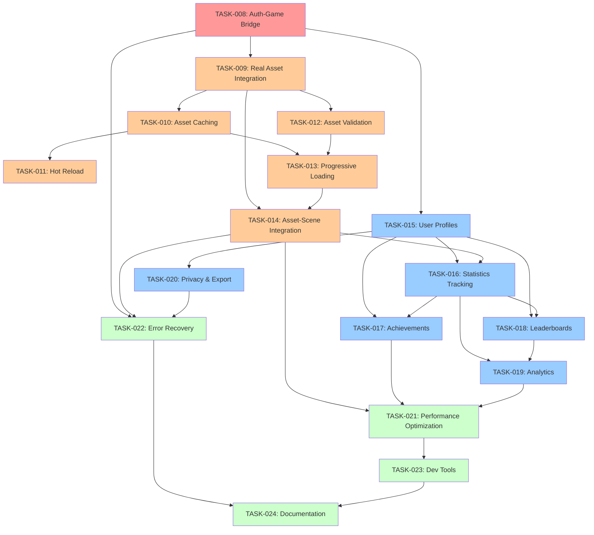

# Implementation Plan: Complete Game System Integration

## Task Summary
Total Tasks: 16
Estimated Effort: 12-15 days
Critical Path: Game Engine Integration → Asset System → Progress Tracking

## Phase 1: Game Engine Integration (CRITICAL - BLOCKING)

### TASK-008: Authentication-Game Bridge Integration
- **Status**: ⏳ pending
- **Description**: Create seamless integration between authentication system and Phaser game engine
- **Expected Output**:
  - AuthGameBridge class connecting auth to game registry
  - Enhanced LoginIntegration with Phaser-specific methods
  - User context propagation to all game scenes
  - Multiplayer connection with authenticated user data
- **TDD Process**:
  1. Write failing tests for auth-game integration flow
  2. Implement AuthGameBridge with minimal user context passing
  3. Refactor to handle all auth state changes and error scenarios
- **Acceptance Test**:
  ```gherkin
  Given a user successfully authenticates
  When the game initializes
  Then their profile data should be available in all game scenes
  And multiplayer should connect with their authenticated user ID
  And scene transitions should preserve user context
  ```
- Dependencies: Completed authentication system (TASK-001 to TASK-007)
- Estimated Time: 4 hours

## Phase 2: Asset System Implementation (HIGH PRIORITY)

### TASK-009: Real Asset Integration
- **Status**: ⏳ pending
- **Description**: Replace mock assets with real filesystem assets from src/assets/
- **Expected Output**:
  - Real track loading from src/assets/maps/tracks/
  - Real background loading from src/assets/maps/backgrounds/
  - Integration with existing AssetManager class
  - Fallback system for missing assets
- **TDD Process**:
  1. Write tests for asset discovery and loading from filesystem
  2. Implement basic file system asset loading
  3. Refactor to include validation, caching, and error handling
- **Acceptance Test**:
  ```gherkin
  Given the game is starting
  When asset loading begins
  Then real track images should load from the filesystem
  And real background images should replace mock data
  And loading progress should be visible to users
  ```
- Dependencies: TASK-008
- Estimated Time: 5 hours

### TASK-010: Asset Caching System
- **Status**: ⏳ pending
- **Description**: Implement efficient memory management and caching for loaded assets
- **Expected Output**:
  - LRU cache integration for asset storage
  - Memory usage monitoring and limits
  - Cache eviction strategies
  - Performance optimization for asset access
- **TDD Process**:
  1. Write tests for cache behavior, eviction, and memory management
  2. Implement basic caching with fixed size limits
  3. Refactor to include LRU eviction and memory monitoring
- **Acceptance Test**:
  ```gherkin
  Given assets are loaded and cached
  When the same assets are requested again
  Then they should be served from cache within 10ms
  And memory usage should not exceed configured limits
  ```
- Dependencies: TASK-009
- Estimated Time: 3 hours

### TASK-011: Hot Reload Development Support
- **Status**: ⏳ pending
- **Description**: Enable real-time asset reloading during development workflow
- **Expected Output**:
  - File system watching for asset changes
  - Automatic cache invalidation on file modification
  - Integration with webpack HMR system
  - Developer notification system for reload events
- **TDD Process**:
  1. Write tests for file change detection and reload behavior
  2. Implement basic file watching with manual reload triggers
  3. Refactor to include automatic detection and HMR integration
- **Acceptance Test**:
  ```gherkin
  Given the game is running in development mode
  When an asset file is modified
  Then the asset should automatically reload in the game
  And no manual refresh should be required
  ```
- Dependencies: TASK-010
- Estimated Time: 3 hours

### TASK-012: Asset Validation System
- **Status**: ⏳ pending
- **Description**: Validate asset quality, dimensions, and format compliance
- **Expected Output**:
  - Dimension validation for track and sprite assets
  - Format compliance checking (PNG, JPG support)
  - Quality assurance for visual consistency
  - Detailed validation reporting for developers
- **TDD Process**:
  1. Write tests for various validation scenarios and edge cases
  2. Implement basic dimension and format validation
  3. Refactor to include comprehensive quality checks and reporting
- **Acceptance Test**:
  ```gherkin
  Given assets are being loaded
  When validation runs
  Then incorrect dimensions should be flagged
  And unsupported formats should be rejected
  And validation results should be logged for debugging
  ```
- Dependencies: TASK-009
- Estimated Time: 2 hours

### TASK-013: Progressive Asset Loading
- **Status**: ⏳ pending
- **Description**: Implement critical asset prioritization and background loading
- **Expected Output**:
  - Critical asset identification and priority loading
  - Background loading for non-essential assets
  - Dynamic loading based on user actions
  - Loading progress feedback and completion tracking
- **TDD Process**:
  1. Write tests for loading prioritization and background processing
  2. Implement basic critical vs. non-critical asset separation
  3. Refactor to include dynamic prioritization and progress tracking
- **Acceptance Test**:
  ```gherkin
  Given the game is starting
  When asset loading begins
  Then critical assets should load first
  And the game should become playable quickly
  And non-critical assets should continue loading in background
  ```
- Dependencies: TASK-010, TASK-012
- Estimated Time: 3 hours

### TASK-014: Asset-Scene Integration
- **Status**: ⏳ pending
- **Description**: Connect loaded assets with game scenes and rendering system
- **Expected Output**:
  - Scene integration for track and background assets
  - Sprite asset integration for players and power-ups
  - Asset cleanup on scene transitions
  - Error handling for missing assets during gameplay
- **TDD Process**:
  1. Write tests for scene-asset integration and cleanup
  2. Implement basic asset injection into Phaser scenes
  3. Refactor to include comprehensive error handling and optimization
- **Acceptance Test**:
  ```gherkin
  Given assets are loaded and available
  When a game scene starts
  Then the scene should use real assets instead of mock data
  And asset cleanup should occur on scene transitions
  And missing assets should not crash the game
  ```
- Dependencies: TASK-009, TASK-013
- Estimated Time: 4 hours

## Phase 3: Progress Tracking System (MEDIUM PRIORITY)

### TASK-015: User Profile Management
- **Status**: ⏳ pending
- **Description**: Create persistent user profile system with statistics tracking
- **Expected Output**:
  - ProfileManager class for user data management
  - Integration with authentication system
  - Persistent storage of user statistics and preferences
  - Profile data validation and backup systems
- **TDD Process**:
  1. Write tests for profile creation, updates, and persistence
  2. Implement basic profile storage with authentication integration
  3. Refactor to include validation, backup, and error recovery
- **Acceptance Test**:
  ```gherkin
  Given a user completes their first race
  When the race results are processed
  Then their profile should be created with initial statistics
  And the data should persist across browser sessions
  And profile updates should be atomic and consistent
  ```
- Dependencies: TASK-008
- Estimated Time: 4 hours

### TASK-016: Real-time Statistics Tracking
- **Status**: ⏳ pending
- **Description**: Implement automatic collection of race performance data
- **Expected Output**:
  - StatisticsTracker integration with race scenes
  - Real-time performance metric calculation
  - Race event logging and processing
  - Statistical analysis and trend calculation
- **TDD Process**:
  1. Write tests for race event tracking and metric calculation
  2. Implement basic event collection during races
  3. Refactor to include comprehensive analysis and real-time updates
- **Acceptance Test**:
  ```gherkin
  Given a race is in progress
  When race events occur (wins, collisions, power-ups)
  Then all events should be automatically tracked
  And statistics should be updated in real-time
  And no manual intervention should be required
  ```
- Dependencies: TASK-015, TASK-014
- Estimated Time: 4 hours

### TASK-017: Achievement System
- **Status**: ⏳ pending
- **Description**: Create achievement unlocking and notification system
- **Expected Output**:
  - AchievementSystem class with configurable achievements
  - Visual notification system for unlocked achievements
  - Progress tracking for incremental achievements
  - Integration with user profiles and UI
- **TDD Process**:
  1. Write tests for achievement evaluation and unlocking logic
  2. Implement basic achievement checking after race completion
  3. Refactor to include notifications, progress tracking, and UI integration
- **Acceptance Test**:
  ```gherkin
  Given a user completes an action that qualifies for an achievement
  When the achievement system processes the action
  Then any unlocked achievements should be identified
  And the user should see visual achievement notifications
  And the achievement should be saved to their profile
  ```
- Dependencies: TASK-015, TASK-016
- Estimated Time: 3 hours

### TASK-018: Leaderboard System
- **Status**: ⏳ pending
- **Description**: Implement competitive ranking and leaderboard display
- **Expected Output**:
  - LeaderboardManager for ranking calculations
  - Multiple leaderboard categories (speed, wins, consistency)
  - Real-time ranking updates
  - UI components for leaderboard display
- **TDD Process**:
  1. Write tests for ranking algorithms and leaderboard updates
  2. Implement basic leaderboard calculation and storage
  3. Refactor to include multiple categories and real-time updates
- **Acceptance Test**:
  ```gherkin
  Given multiple players have completed races
  When leaderboards are calculated
  Then players should be ranked accurately across different categories
  And rankings should update immediately after race completion
  And ties should be broken with consistent rules
  ```
- Dependencies: TASK-015, TASK-016
- Estimated Time: 4 hours

### TASK-019: Performance Analytics
- **Status**: ⏳ pending
- **Description**: Generate detailed performance analytics and trends
- **Expected Output**:
  - Analytics engine for performance trend analysis
  - Comparative statistics against other players
  - Improvement suggestions and goal tracking
  - Visual charts and graphs for data presentation
- **TDD Process**:
  1. Write tests for analytics calculations and trend analysis
  2. Implement basic performance comparison and trend detection
  3. Refactor to include comprehensive analytics and visualization
- **Acceptance Test**:
  ```gherkin
  Given a user has sufficient race history
  When they view their analytics
  Then they should see performance trends over time
  And areas for improvement should be highlighted
  And progress toward goals should be tracked
  ```
- Dependencies: TASK-016, TASK-018
- Estimated Time: 3 hours

### TASK-020: Data Privacy and Export
- **Status**: ⏳ pending
- **Description**: Implement data export and privacy compliance features
- **Expected Output**:
  - Data export functionality for user profiles
  - Privacy controls for data sharing and visibility
  - GDPR compliance features for data deletion
  - Audit logging for data access and modifications
- **TDD Process**:
  1. Write tests for data export, privacy controls, and deletion
  2. Implement basic export functionality and privacy settings
  3. Refactor to include full GDPR compliance and audit logging
- **Acceptance Test**:
  ```gherkin
  Given a user requests to export their data
  When the export process runs
  Then they should receive complete profile data in readable format
  And they should be able to control data visibility
  And data deletion should be complete and irreversible when requested
  ```
- Dependencies: TASK-015
- Estimated Time: 3 hours

## Phase 4: System Integration and Polish (LOW PRIORITY)

### TASK-021: Performance Optimization
- **Status**: ⏳ pending
- **Description**: Optimize overall system performance and resource usage
- **Expected Output**:
  - Performance profiling and bottleneck identification
  - Memory usage optimization across all systems
  - Network request optimization for multiplayer features
  - Frame rate maintenance during intensive operations
- **TDD Process**:
  1. Write performance tests for all major system operations
  2. Implement basic optimization for identified bottlenecks
  3. Refactor to achieve target performance metrics
- **Acceptance Test**:
  ```gherkin
  Given all systems are running simultaneously
  When the game is under full load
  Then frame rate should maintain 60 FPS
  And memory usage should stay within limits
  And network latency should be minimal
  ```
- Dependencies: All previous tasks
- Estimated Time: 4 hours

### TASK-022: Error Recovery and Resilience
- **Status**: ⏳ pending
- **Description**: Enhance error handling and system resilience
- **Expected Output**:
  - Comprehensive error boundary system
  - Graceful degradation for system failures
  - Recovery mechanisms for temporary issues
  - User-friendly error messaging and reporting
- **TDD Process**:
  1. Write tests for various error scenarios and recovery paths
  2. Implement basic error boundaries and fallback systems
  3. Refactor to include comprehensive error handling and user messaging
- **Acceptance Test**:
  ```gherkin
  Given a system component fails during gameplay
  When the error occurs
  Then the game should continue functioning where possible
  And users should see helpful error messages
  And recovery should be automatic when feasible
  ```
- Dependencies: TASK-008, TASK-014, TASK-020
- Estimated Time: 3 hours

### TASK-023: Development Tools and Debugging
- **Status**: ⏳ pending
- **Description**: Create comprehensive development and debugging tools
- **Expected Output**:
  - Debug panels for system monitoring
  - Development console commands
  - Performance monitoring tools
  - Asset and statistics inspection tools
- **TDD Process**:
  1. Write tests for debug tool functionality and accuracy
  2. Implement basic debug panels and console commands
  3. Refactor to include comprehensive monitoring and inspection tools
- **Acceptance Test**:
  ```gherkin
  Given the game is running in development mode
  When developers use debug tools
  Then they should have complete visibility into system state
  And debug commands should be available for testing
  And performance metrics should be accessible in real-time
  ```
- Dependencies: All major system tasks
- Estimated Time: 3 hours

### TASK-024: Documentation and Integration Testing
- **Status**: ⏳ pending
- **Description**: Complete system documentation and comprehensive testing
- **Expected Output**:
  - Complete API documentation for all systems
  - Integration test suite covering all workflows
  - User guide for game features
  - Developer guide for system maintenance
- **TDD Process**:
  1. Write comprehensive integration tests for all system interactions
  2. Implement basic documentation structure and content
  3. Refactor to include complete coverage and user guides
- **Acceptance Test**:
  ```gherkin
  Given all systems are implemented
  When integration tests run
  Then all workflows should complete successfully
  And documentation should be complete and accurate
  And new developers should be able to understand the system
  ```
- Dependencies: All previous tasks
- Estimated Time: 4 hours

## Task Dependencies Visualization



## Implementation Strategy

### Critical Path Priority
1. **TASK-008** (Auth-Game Bridge) - MUST be completed first, blocks everything else
2. **TASK-009** (Real Asset Integration) - Unblocks visual improvements
3. **TASK-015** (User Profiles) - Foundation for progress tracking
4. **TASK-016** (Statistics Tracking) - Core functionality for user engagement

### Resource Allocation
- **Week 1**: Focus entirely on TASK-008 and TASK-009 (critical path)
- **Week 2**: Complete asset system (TASK-010 to TASK-014)
- **Week 3**: Implement core progress tracking (TASK-015 to TASK-018)
- **Week 4**: Complete system with analytics, privacy, and polish

### Risk Mitigation
- **Parallel Development**: Some asset system tasks can run parallel after TASK-009
- **Minimum Viable Product**: TASK-008, TASK-009, and TASK-015 create a functional game
- **Incremental Delivery**: Each completed task provides immediate value
- **Testing Focus**: Critical path tasks get maximum testing attention

## Success Metrics

### Functional Metrics
- **100% Authentication Integration**: All game features work with authenticated users
- **Zero Mock Data**: All game assets loaded from real files
- **Complete Progress Tracking**: All player actions recorded and analyzed
- **Error-Free Operation**: No system crashes or data loss during normal operation

### Performance Metrics
- **< 3 Second Load Time**: Complete game initialization including assets
- **60 FPS Maintained**: No performance degradation from new systems
- **< 200MB Memory**: Total memory usage stays within reasonable limits
- **< 500ms Response**: All user interactions respond quickly

### Quality Metrics
- **100% Test Coverage**: All critical paths covered by automated tests
- **Complete Documentation**: All systems documented for maintenance
- **GDPR Compliance**: Full privacy regulation compliance
- **Cross-Browser Support**: Works in all major modern browsers

## Emergency Procedures

### If TASK-008 Fails
- **Fallback**: Implement minimal auth bypass for development
- **Impact**: Delays entire project timeline
- **Recovery**: Focus team resources on resolving integration issues

### If Asset System Fails
- **Fallback**: Continue with enhanced mock system
- **Impact**: Game playable but not visually complete
- **Recovery**: Implement progressive migration from mock to real assets

### If Progress System Fails
- **Fallback**: Basic statistics in local storage
- **Impact**: No leaderboards or achievements
- **Recovery**: Implement simplified tracking system first

The systematic approach ensures that even if later phases encounter issues, the core game remains functional with authentication and real assets.