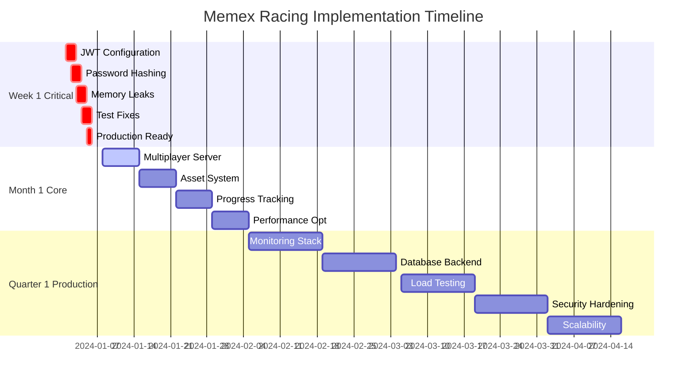

# Memex Racing Game - Implementation Roadmap

## Overview
This document provides a comprehensive roadmap for transforming the Memex Racing game from its current state with critical production-blocking issues into a robust, scalable, enterprise-grade multiplayer gaming platform.

## Current State Analysis
- **Critical Issues**: JWT configuration missing, no password hashing, memory leaks, 19 test failures
- **Infrastructure**: Client-only multiplayer (no server), mock assets, localStorage-based data
- **Code Quality**: 1661-line RaceScene.js file, unoptimized performance, limited monitoring
- **Production Readiness**: Not deployable due to security vulnerabilities and stability issues

## Strategic Implementation Phases

### Phase 1: Week 1 - Critical Security & Stability Fixes
**Status**: BLOCKING PRODUCTION DEPLOYMENT
**Timeline**: 5-7 days
**Priority**: Critical

#### Scope
- **REQ-001**: JWT Secret Configuration Fix
- **REQ-002**: Password Hashing Implementation  
- **REQ-003**: Memory Leak Resolution
- **REQ-004**: Test Suite Stabilization
- **REQ-005**: Production Startup Reliability

#### Key Deliverables
- ✅ JWT_SECRET environment validation with secure defaults
- ✅ bcrypt password hashing with salt rounds ≥ 12
- ✅ Memory management registry for timers/events/tweens
- ✅ All 279 tests passing consistently
- ✅ Production-ready startup sequence

#### Success Criteria
- Application starts successfully in production
- Zero plaintext passwords in database
- Memory usage stable over 24-hour period
- 100% test suite success rate
- JWT tokens securely configured

#### Files Modified
- `/src/auth/config.js` - Environment validation
- `/src/auth/PasswordValidator.js` - Add bcrypt integration
- `/src/auth/BrowserJWTManager.js` - Memory leak fixes
- `/src/index.js` - Event listener cleanup
- `/tests/` - Fix crypto mocking and request handling

### Phase 2: Month 1 - Core Features Implementation  
**Status**: CORE FUNCTIONALITY
**Timeline**: 3-4 weeks  
**Priority**: High

#### Scope
- **REQ-006**: Multiplayer Server Implementation
- **REQ-007**: Complete Asset System
- **REQ-008**: Progress Tracking System
- **REQ-009**: Performance Optimization
- **REQ-010**: Scene Management Refactoring

#### Key Deliverables
- ✅ Socket.io multiplayer server with room management
- ✅ 32x32/64x64 pixel art asset pipeline
- ✅ PostgreSQL-based progress tracking and leaderboards
- ✅ 60 FPS performance optimization
- ✅ Modular scene architecture (no files > 300 lines)

#### Success Criteria
- 6-player multiplayer races working smoothly
- All game assets loading within 10 seconds
- Real-time leaderboards and player statistics
- Consistent 60 FPS with full effects
- Maintainable, modular codebase

#### Technical Architecture
```
Client Layer (Phaser.js)
├── Modular Scene Components
├── Asset Management Pipeline
└── Performance Monitoring

Multiplayer Layer (Socket.io)
├── Room Management
├── Real-time State Sync
└── Player Connection Handling

Data Layer (PostgreSQL + Redis)
├── User Statistics
├── Leaderboard Calculations
└── Session Management
```

### Phase 3: Quarter 1 - Production Enhancement
**Status**: ENTERPRISE GRADE
**Timeline**: 8-12 weeks
**Priority**: Medium-High

#### Scope
- **REQ-011**: Advanced Monitoring and Logging System
- **REQ-012**: Database Backend Implementation
- **REQ-013**: Load Testing Framework
- **REQ-014**: Code Architecture Refactoring
- **REQ-015**: Security Hardening and Compliance
- **REQ-016**: Scalability and Infrastructure Optimization

#### Key Deliverables
- ✅ Prometheus/Grafana monitoring stack
- ✅ PostgreSQL with read replicas and Redis caching
- ✅ K6-based load testing framework
- ✅ OWASP security compliance
- ✅ Kubernetes-based auto-scaling infrastructure
- ✅ 99.9% uptime SLA capability

#### Success Criteria
- Support 5,000 concurrent players
- Sub-200ms global response times
- Comprehensive security compliance
- Automated load testing and deployment
- Enterprise-grade operational monitoring

## Technical Implementation Strategy

### Security-First Approach
All phases prioritize security with:
- Environment-based configuration management
- Secure password hashing (bcrypt with proper salt rounds)
- Input validation and sanitization
- Rate limiting and DDoS protection
- Regular security scanning and compliance checks

### Performance-Driven Architecture  
Each phase optimizes for:
- 60 FPS gameplay experience
- Sub-100ms database query response
- Efficient memory management
- Network optimization for multiplayer
- Progressive asset loading

### Scalability Planning
Architecture designed for:
- Horizontal scaling of application servers
- Database read replicas for query distribution
- CDN integration for global asset delivery
- Auto-scaling based on user load
- Multi-region deployment capability

## Risk Mitigation Strategy

### Week 1 Risks
- **Risk**: Breaking existing functionality during security fixes
- **Mitigation**: Comprehensive test coverage, staged rollout, rollback plan

- **Risk**: Database migration complexity
- **Mitigation**: Reversible migrations, staging environment testing

### Month 1 Risks
- **Risk**: Multiplayer complexity and synchronization issues
- **Mitigation**: Incremental implementation, extensive testing

- **Risk**: Performance degradation with new features
- **Mitigation**: Performance monitoring, quality gates in CI/CD

### Quarter 1 Risks
- **Risk**: Infrastructure complexity and operational overhead
- **Mitigation**: Gradual scaling, comprehensive monitoring, automation

## Quality Assurance Framework

### Test-Driven Development (TDD)
- Write failing tests first (Red phase)
- Implement minimal code to pass (Green phase)  
- Refactor for quality (Refactor phase)
- Maintain 85%+ test coverage

### Behavior-Driven Development (BDD)
- Gherkin scenarios for all user stories
- Acceptance criteria validation
- End-to-end testing of user journeys
- Business stakeholder involvement

### Performance Testing
- Load testing at each phase
- Performance regression detection
- Memory leak monitoring
- Response time validation

## Implementation Timeline



## Resource Requirements

### Development Team
- **Week 1**: 2-3 senior developers (security, backend)
- **Month 1**: 4-5 developers (full-stack, multiplayer, frontend)
- **Quarter 1**: 6-8 developers (DevOps, security, performance)

### Infrastructure
- **Week 1**: Staging environment, CI/CD pipeline setup
- **Month 1**: Production environment, database servers, CDN
- **Quarter 1**: Monitoring infrastructure, load balancers, multi-region setup

### External Dependencies
- **Security**: Security audit, penetration testing
- **Performance**: Load testing tools, monitoring services
- **Compliance**: Legal review for data protection compliance

## Success Metrics by Phase

### Week 1 Metrics
- ✅ 0 production-blocking security vulnerabilities
- ✅ 100% test suite pass rate
- ✅ < 30 second production startup time
- ✅ 0 memory leaks detected in 24-hour test

### Month 1 Metrics  
- ✅ 6 concurrent players per race
- ✅ 60 FPS consistent performance
- ✅ < 10 second asset loading time
- ✅ Real-time multiplayer synchronization < 50ms latency

### Quarter 1 Metrics
- ✅ 99.9% uptime (< 8.76 hours downtime/year)
- ✅ 5,000 concurrent players supported
- ✅ < 200ms global response times
- ✅ 0 critical security vulnerabilities
- ✅ Automated deployment and scaling

## Business Impact

### Week 1 Impact
- **Production Deployment**: Unblocks ability to deploy to production
- **Security Compliance**: Meets basic security requirements
- **User Trust**: Establishes foundation for secure user data handling

### Month 1 Impact  
- **User Engagement**: Provides complete multiplayer gaming experience
- **Retention**: Progress tracking and leaderboards increase user retention
- **Performance**: Smooth gameplay experience drives positive reviews

### Quarter 1 Impact
- **Scale**: Supports business growth with enterprise-grade infrastructure
- **Reliability**: Professional-grade service levels
- **Market Readiness**: Production-ready for large-scale user acquisition

## Communication Plan

### Stakeholder Updates
- **Daily**: Development team standups during Week 1
- **Weekly**: Progress reports to business stakeholders
- **Milestone**: Detailed reports at end of each phase

### User Communication
- **Week 1**: Internal testing only
- **Month 1**: Beta testing with limited user group
- **Quarter 1**: Full production launch communication

## Conclusion

This roadmap provides a systematic approach to transforming Memex Racing from a prototype with critical issues into a production-ready, enterprise-grade multiplayer gaming platform. The phased approach ensures:

1. **Week 1** solves immediate production blockers
2. **Month 1** delivers core gaming functionality  
3. **Quarter 1** achieves enterprise-grade operational excellence

Each phase builds upon the previous, with clear success criteria, risk mitigation strategies, and quality assurance frameworks. The systematic workflow following TDD/BDD principles ensures high-quality, maintainable code that meets business requirements.

The implementation follows the established `/spec`, `/design`, `/implement_plan` methodology, providing clear traceability from requirements through implementation, ensuring all stakeholder needs are met while maintaining technical excellence.

---

**Next Steps**: Begin Week 1 implementation with `/implement_plan` to create detailed task breakdowns for each requirement, followed by `/go` commands to execute tasks systematically with TDD methodology.