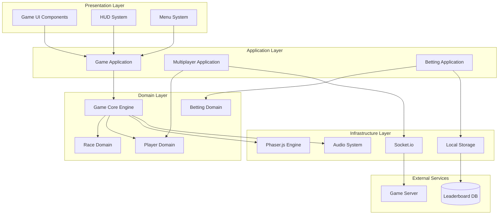

# Technical Design: Modular Architecture Transformation

## Architecture Overview

The new modular architecture transforms Memex Racing from a monolithic structure into a scalable, maintainable system with clear separation of concerns. The design follows hexagonal architecture principles with domain-driven design patterns.



## Technology Stack

### Core Technologies
- **Game Engine**: Phaser.js 3.x (maintained, no changes to existing integration)
- **Module System**: ES6 Modules with dynamic imports for code splitting
- **Build System**: Webpack 5 for module bundling and tree shaking
- **Package Management**: npm with workspace support for module dependencies
- **Type Safety**: JSDoc with TypeScript-style annotations for runtime safety

### Infrastructure
- **Multiplayer**: Socket.io (existing, to be wrapped in adapters)
- **State Management**: Custom event-driven state machines per domain
- **Asset Loading**: Phaser's asset loader with modular asset manifests
- **Testing**: Jest with module-specific test suites

## Component Design

### 1. Game Core Engine
**Purpose**: Central coordinator for all game systems
**Interfaces**:
```javascript
class GameCore {
  // Public API
  initialize(config)
  startRace(raceConfig)
  pauseRace()
  endRace()
  
  // Event System
  on(event, handler)
  emit(event, data)
  off(event, handler)
  
  // Module Management
  loadModule(moduleName)
  unloadModule(moduleName)
  getModule(moduleName)
}
```

**Dependencies**: 
- Phaser.js engine
- Module registry
- Event bus system

### 2. Player Management Module
**Purpose**: Handle player entities, movement, and abilities
**Interfaces**:
```javascript
class PlayerModule {
  createPlayer(id, config)
  updatePlayer(id, deltaTime)
  removePlayer(id)
  
  // Movement System
  processMovement(playerId, deltaTime)
  handleCollision(playerId, collision)
  
  // Skill System
  activateSkill(playerId, skillType)
  updateCooldowns(deltaTime)
}
```

**Dependencies**:
- Movement system
- Collision detection
- Skill definitions

### 3. Race Management Module
**Purpose**: Control race flow, timing, and win conditions
**Interfaces**:
```javascript
class RaceModule {
  initializeRace(mapId, players)
  updateRaceTimer(deltaTime)
  checkWinCondition()
  
  // Map System
  loadMap(mapId)
  getValidSpawnPositions()
  placeToken(position)
}
```

**Dependencies**:
- Map loader
- Timer system
- Token management

### 4. Betting System Module
**Purpose**: Handle betting mechanics and leaderboard
**Interfaces**:
```javascript
class BettingModule {
  placeBet(playerId, amount, target)
  calculateOdds(raceState)
  processPayouts(raceResult)
  
  // Leaderboard
  updatePlayerStats(playerId, result)
  getLeaderboard(filter)
}
```

**Dependencies**:
- Statistics calculator
- Storage adapter
- Odds calculator

### 5. Multiplayer Module
**Purpose**: Handle network communication and synchronization
**Interfaces**:
```javascript
class MultiplayerModule {
  connect(serverUrl)
  disconnect()
  
  // Room Management
  joinRoom(roomId)
  leaveRoom()
  
  // State Sync
  broadcastState(gameState)
  receiveState(remoteState)
}
```

**Dependencies**:
- Socket.io adapter
- State serializer
- Conflict resolver

## Data Model

### Core Game State
```javascript
const GameState = {
  race: {
    id: String,
    status: 'waiting' | 'active' | 'finished',
    timer: Number,
    mapId: String
  },
  players: Map<String, {
    id: String,
    position: { x: Number, y: Number },
    direction: Number,
    speed: Number,
    skills: Array<Skill>,
    isStuck: Boolean,
    stuckCounter: Number
  }>,
  token: {
    position: { x: Number, y: Number },
    isCollected: Boolean
  },
  boosters: Array<{
    id: String,
    type: String,
    position: { x: Number, y: Number },
    duration: Number
  }>
};
```

### Module Configuration Schema
```javascript
const ModuleConfig = {
  name: String,
  version: String,
  dependencies: Array<String>,
  assets: Array<String>,
  exports: Object,
  lifecycle: {
    initialize: Function,
    update: Function,
    cleanup: Function
  }
};
```

### Event System Schema
```javascript
const GameEvent = {
  type: String,
  source: String,
  timestamp: Number,
  data: Object,
  propagate: Boolean
};
```

## API Design

### Module Registry API
```javascript
// Module Registration
ModuleRegistry.register(name, moduleDefinition)
ModuleRegistry.unregister(name)
ModuleRegistry.get(name)
ModuleRegistry.list()

// Dependency Resolution
ModuleRegistry.loadDependencies(moduleName)
ModuleRegistry.checkCircularDependencies()
```

### Event Bus API
```javascript
// Event Management
EventBus.subscribe(eventType, handler, priority)
EventBus.unsubscribe(eventType, handler)
EventBus.publish(event)
EventBus.clear()

// Event Filtering
EventBus.filter(predicate)
EventBus.once(eventType, handler)
```

### Configuration API
```javascript
// Module Configuration
Config.load(filePath)
Config.get(key, defaultValue)
Config.set(key, value)
Config.validate(schema)

// Environment-specific configs
Config.loadEnvironment(env)
Config.merge(configs)
```

## Module System Architecture

### Module Lifecycle
1. **Registration**: Module registers with the registry
2. **Dependency Resolution**: System resolves and loads dependencies
3. **Initialization**: Module initializes with provided configuration
4. **Runtime**: Module receives update calls and handles events
5. **Cleanup**: Module cleans up resources before unload

### Hot Swapping System
```javascript
class HotSwapManager {
  // Enable hot swapping for development
  enableHotSwap(moduleName)
  
  // Replace module at runtime
  swapModule(oldModule, newModule)
  
  // Preserve state during swap
  preserveState(moduleState)
  restoreState(moduleState)
}
```

### Module Communication
- **Event-driven**: Modules communicate through centralized event bus
- **Loose coupling**: No direct module-to-module dependencies
- **Type safety**: Event schemas validated at runtime
- **Performance**: Event pooling and batching for high-frequency events

## Testing Strategy

### Unit Testing
- **Module Isolation**: Each module tested in isolation with mocked dependencies
- **Event Testing**: Verify correct event emission and handling
- **State Testing**: Validate state transitions and data integrity
- **Configuration Testing**: Test various configuration scenarios

### Integration Testing
- **Module Interaction**: Test communication between modules
- **Event Flow**: Verify complex event chains work correctly
- **Performance**: Measure module loading and communication overhead
- **Hot Swap**: Test runtime module replacement scenarios

### System Testing
- **Full Game Flow**: Complete race scenarios with all modules active
- **Multiplayer Sync**: Network synchronization with modular architecture
- **Memory Management**: Verify proper cleanup and no memory leaks
- **Asset Loading**: Test modular asset loading and unloading

## Performance Considerations

### Loading Performance
- **Lazy Loading**: Modules loaded on demand to reduce initial bundle size
- **Code Splitting**: Webpack bundles modules separately for optimal loading
- **Asset Bundling**: Each module declares its required assets for efficient loading
- **Caching Strategy**: Module definitions cached in browser storage

### Runtime Performance
- **Event Batching**: High-frequency events batched to reduce overhead
- **Update Scheduling**: Module updates scheduled based on priority and frequency
- **Memory Pooling**: Object pools for frequently created/destroyed entities
- **Profile Integration**: Built-in performance monitoring for each module

### Network Optimization
- **State Diffing**: Only changed state synchronized over network
- **Compression**: Game state compressed before network transmission
- **Prediction**: Client-side prediction reduces perceived latency
- **Reconciliation**: Server authoritative with smooth client reconciliation

## Security Considerations

### Module Security
- **Sandboxing**: Modules run in restricted contexts to prevent interference
- **Permission System**: Modules declare required permissions explicitly
- **Code Integrity**: Module signatures verified before loading
- **API Boundaries**: Clear API boundaries prevent unauthorized access

### Network Security
- **State Validation**: All networked state changes validated on server
- **Rate Limiting**: Prevent spam of network events from clients
- **Input Sanitization**: All player inputs sanitized before processing
- **Cheat Detection**: Monitor for impossible state changes or inputs

## Migration Strategy

### Phase 1: Core Infrastructure (Current Phase)
- Set up module registry and event bus
- Create base module classes and interfaces
- Implement hot swapping system
- Build development tooling

### Phase 2: System Modules
- Extract player management into module
- Extract race logic into module
- Extract betting system into module
- Maintain existing functionality during extraction

### Phase 3: Feature Modules
- Convert skill system to modular plugins
- Convert booster system to modular plugins
- Convert map system to modular assets
- Add new features as separate modules

### Phase 4: Optimization
- Optimize module loading performance
- Implement advanced caching strategies
- Add comprehensive monitoring
- Performance tuning and cleanup

## Development Workflow

### Module Development
1. **Create Module**: Use module template generator
2. **Define Interface**: Specify public API and events
3. **Implement Logic**: Write module functionality
4. **Write Tests**: Unit and integration tests
5. **Register Module**: Add to module registry
6. **Integration**: Test with existing system

### Hot Development
1. **Watch Mode**: File watcher rebuilds changed modules
2. **Auto Reload**: Hot swap updated modules in running game
3. **State Preservation**: Maintain game state during development
4. **Debug Tools**: Module-specific debugging and profiling

## Monitoring and Debugging

### Module Monitoring
- **Performance Metrics**: Track module loading times and memory usage
- **Event Tracking**: Monitor event flow and processing times
- **Error Reporting**: Centralized error reporting with module context
- **Health Checks**: Regular module health and dependency validation

### Debug Tools
- **Module Inspector**: View loaded modules and their states
- **Event Debugger**: Visualize event flow between modules
- **State Viewer**: Inspect module-specific state in real-time
- **Performance Profiler**: Identify bottlenecks in module execution

This modular architecture provides a solid foundation for scalable development while maintaining the existing game's performance and functionality. The system allows for incremental migration and supports both current features and future enhancements through the plugin system.