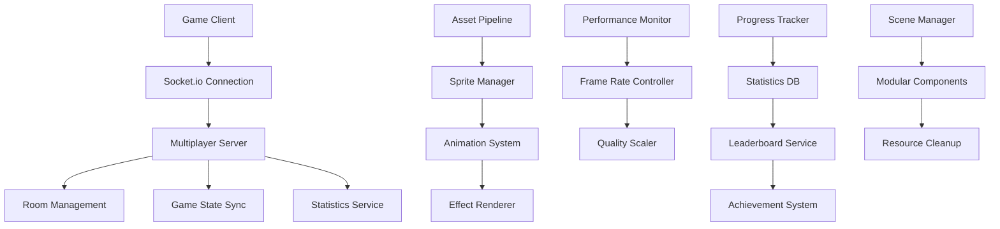

# Technical Design: Month 1 Core Features Implementation

## Architecture Overview
The Month 1 implementation focuses on building robust multiplayer infrastructure, completing the asset pipeline, implementing progress tracking, and optimizing performance. The architecture emphasizes modularity, scalability, and maintainability.



## Technology Stack
- **Multiplayer**: Socket.io 4.7+ for real-time communication
- **Game Engine**: Phaser.js 3.x with optimized rendering pipeline
- **Database**: PostgreSQL for statistics, Redis for session management
- **Asset Management**: Custom pipeline with CDN integration
- **Performance**: Web Workers for heavy computations
- **Monitoring**: Custom performance metrics with alerting

## Component Design

### Component: Multiplayer Server Infrastructure
- **Purpose**: Handle real-time multiplayer racing with room management
- **Interfaces**:
  - `createRoom(hostId: string): Promise<Room>`
  - `joinRoom(roomId: string, playerId: string): Promise<boolean>`
  - `syncGameState(roomId: string, state: GameState): void`
  - `handlePlayerDisconnect(playerId: string): void`
- **Dependencies**: Socket.io, Express.js, Redis

### Component: Asset Management System
- **Purpose**: Efficiently load, cache, and display game assets
- **Interfaces**:
  - `loadSprites(category: string): Promise<SpriteCollection>`
  - `playAnimation(sprite: string, animation: string): void`
  - `preloadAssets(priority: number): Promise<void>`
  - `getAssetStatus(): AssetLoadingStatus`
- **Dependencies**: Phaser.js, CDN service

### Component: Progress Tracking Service
- **Purpose**: Record player statistics and maintain leaderboards
- **Interfaces**:
  - `recordRaceResult(playerId: string, result: RaceResult): Promise<void>`
  - `getPlayerStats(playerId: string): Promise<PlayerStats>`
  - `getLeaderboard(type: string, limit: number): Promise<LeaderboardEntry[]>`
  - `checkAchievements(playerId: string): Promise<Achievement[]>`
- **Dependencies**: PostgreSQL, Redis cache

### Component: Performance Optimization Manager
- **Purpose**: Monitor and optimize game performance dynamically
- **Interfaces**:
  - `monitorFrameRate(): void`
  - `adjustQuality(targetFPS: number): void`
  - `optimizeCollisionDetection(): void`
  - `getPerformanceMetrics(): PerformanceStats`
- **Dependencies**: Web Performance API, Phaser.js

## Implementation Details

### Multiplayer Server Architecture
```javascript
// Socket.io server with room management
class MultiplayerServer {
  constructor() {
    this.io = new Server(server, {
      cors: { origin: process.env.CLIENT_URL },
      pingTimeout: 60000,
      pingInterval: 25000
    });
    
    this.rooms = new Map();
    this.players = new Map();
    this.gameStates = new Map();
  }
  
  async createRoom(hostId) {
    const roomId = this.generateRoomId();
    const room = {
      id: roomId,
      host: hostId,
      players: [hostId],
      status: 'waiting',
      maxPlayers: 6,
      gameState: this.initializeGameState()
    };
    
    this.rooms.set(roomId, room);
    return room;
  }
  
  async joinRoom(roomId, playerId) {
    const room = this.rooms.get(roomId);
    if (!room || room.players.length >= room.maxPlayers) {
      return false;
    }
    
    room.players.push(playerId);
    this.players.set(playerId, roomId);
    
    // Notify all players in room
    this.io.to(roomId).emit('player_joined', {
      playerId,
      playerCount: room.players.length
    });
    
    // Start race if room is full
    if (room.players.length === room.maxPlayers) {
      this.startRace(roomId);
    }
    
    return true;
  }
  
  syncGameState(roomId, playerId, playerState) {
    const room = this.rooms.get(roomId);
    if (!room || !room.players.includes(playerId)) return;
    
    // Update player state in game state
    room.gameState.players[playerId] = {
      ...room.gameState.players[playerId],
      ...playerState,
      timestamp: Date.now()
    };
    
    // Broadcast to all other players
    this.io.to(roomId).except(playerId).emit('game_state_update', {
      playerId,
      state: playerState,
      serverTime: Date.now()
    });
  }
}
```

### Asset Management Pipeline
```javascript
class AssetManager {
  constructor(scene) {
    this.scene = scene;
    this.loadedAssets = new Map();
    this.loadingQueue = [];
    this.preloadCache = new Map();
  }
  
  async loadSprites(category) {
    const sprites = await this.fetchSpriteManifest(category);
    const loadPromises = sprites.map(sprite => this.loadSprite(sprite));
    
    const results = await Promise.allSettled(loadPromises);
    
    // Handle failed loads with fallbacks
    results.forEach((result, index) => {
      if (result.status === 'rejected') {
        console.warn(`Failed to load sprite: ${sprites[index].name}`);
        this.loadFallbackSprite(sprites[index]);
      }
    });
    
    return this.loadedAssets.get(category);
  }
  
  async loadSprite(spriteConfig) {
    const { name, url, width, height } = spriteConfig;
    
    return new Promise((resolve, reject) => {
      this.scene.load.spritesheet(name, url, {
        frameWidth: width,
        frameHeight: height
      });
      
      this.scene.load.once(`filecomplete-spritesheet-${name}`, resolve);
      this.scene.load.once(`loaderror`, reject);
      
      if (!this.scene.load.isLoading()) {
        this.scene.load.start();
      }
    });
  }
  
  optimizeAssetLoading() {
    // Implement progressive loading
    const criticalAssets = this.getCriticalAssets();
    const nonCriticalAssets = this.getNonCriticalAssets();
    
    // Load critical assets first
    return this.loadSprites(criticalAssets)
      .then(() => {
        // Load non-critical assets in background
        setTimeout(() => {
          this.loadSprites(nonCriticalAssets);
        }, 1000);
      });
  }
}
```

### Progress Tracking Database Schema
```sql
-- Player statistics table
CREATE TABLE player_stats (
    player_id UUID PRIMARY KEY REFERENCES users(id),
    total_races INTEGER DEFAULT 0,
    wins INTEGER DEFAULT 0,
    avg_position DECIMAL(3,2) DEFAULT 0.0,
    total_points INTEGER DEFAULT 0,
    best_time INTERVAL,
    favorite_skill VARCHAR(50),
    skill_usage JSONB DEFAULT '{}',
    achievements JSONB DEFAULT '[]',
    created_at TIMESTAMP DEFAULT CURRENT_TIMESTAMP,
    updated_at TIMESTAMP DEFAULT CURRENT_TIMESTAMP
);

-- Race results table for detailed history
CREATE TABLE race_results (
    id UUID PRIMARY KEY DEFAULT gen_random_uuid(),
    player_id UUID REFERENCES users(id),
    room_id VARCHAR(50) NOT NULL,
    position INTEGER NOT NULL,
    race_time INTERVAL,
    skills_used JSONB,
    boosters_collected INTEGER DEFAULT 0,
    final_score INTEGER DEFAULT 0,
    created_at TIMESTAMP DEFAULT CURRENT_TIMESTAMP
);

-- Leaderboard materialized view for performance
CREATE MATERIALIZED VIEW leaderboard AS
SELECT 
    player_id,
    username,
    total_races,
    wins,
    ROUND((wins::DECIMAL / NULLIF(total_races, 0)) * 100, 2) as win_rate,
    total_points,
    -- Weighted score combining win rate and activity
    ROUND(
        (wins::DECIMAL / NULLIF(total_races, 0)) * 0.7 + 
        (total_points::DECIMAL / GREATEST(total_races * 100, 1)) * 0.3
    , 4) as weighted_score
FROM player_stats ps
JOIN users u ON ps.player_id = u.id
WHERE total_races >= 5  -- Minimum races for ranking
ORDER BY weighted_score DESC, total_points DESC;

-- Index for performance
CREATE INDEX idx_leaderboard_weighted_score ON leaderboard(weighted_score DESC);
```

### Performance Optimization System
```javascript
class PerformanceManager {
  constructor(scene) {
    this.scene = scene;
    this.targetFPS = 60;
    this.frameTimeHistory = [];
    this.qualityLevel = 'high';
    this.performanceMetrics = {
      avgFrameTime: 0,
      dropCount: 0,
      memoryUsage: 0
    };
  }
  
  startMonitoring() {
    this.scene.time.addEvent({
      delay: 100, // Check every 100ms
      callback: this.checkPerformance,
      callbackScope: this,
      loop: true
    });
  }
  
  checkPerformance() {
    const currentTime = performance.now();
    const frameTime = currentTime - this.lastFrameTime;
    this.lastFrameTime = currentTime;
    
    this.frameTimeHistory.push(frameTime);
    if (this.frameTimeHistory.length > 60) {
      this.frameTimeHistory.shift();
    }
    
    const avgFrameTime = this.frameTimeHistory.reduce((a, b) => a + b) / this.frameTimeHistory.length;
    const currentFPS = 1000 / avgFrameTime;
    
    if (currentFPS < this.targetFPS - 10) {
      this.degradeQuality();
    } else if (currentFPS > this.targetFPS + 5 && this.qualityLevel !== 'high') {
      this.improveQuality();
    }
  }
  
  degradeQuality() {
    switch (this.qualityLevel) {
      case 'high':
        this.qualityLevel = 'medium';
        this.reduceParticleEffects();
        break;
      case 'medium':
        this.qualityLevel = 'low';
        this.disableNonEssentialAnimations();
        break;
    }
  }
  
  optimizeCollisionDetection() {
    // Use spatial hashing for collision detection
    const spatialHash = new SpatialHashGrid(64); // 64px grid cells
    
    this.scene.physics.world.on('worldstep', () => {
      spatialHash.clear();
      
      // Add all game objects to spatial hash
      this.scene.children.list.forEach(obj => {
        if (obj.body) {
          spatialHash.insert(obj);
        }
      });
      
      // Only check collisions within same grid cells
      spatialHash.checkCollisions();
    });
  }
}
```

### Modular Scene Architecture
```javascript
// Refactored RaceScene with modular components
class RaceScene extends Phaser.Scene {
  constructor() {
    super({ key: 'RaceScene' });
    this.modules = new Map();
  }
  
  create() {
    // Initialize modules
    this.modules.set('movement', new MovementModule(this));
    this.modules.set('ui', new UIModule(this));
    this.modules.set('physics', new PhysicsModule(this));
    this.modules.set('audio', new AudioModule(this));
    this.modules.set('multiplayer', new MultiplayerModule(this));
    
    // Initialize all modules
    for (const [name, module] of this.modules) {
      try {
        module.initialize();
      } catch (error) {
        console.error(`Failed to initialize ${name} module:`, error);
        // Continue with other modules
      }
    }
  }
  
  update() {
    // Update all modules
    for (const [name, module] of this.modules) {
      if (module.update && module.isActive) {
        module.update();
      }
    }
  }
  
  shutdown() {
    // Clean up all modules
    for (const [name, module] of this.modules) {
      if (module.cleanup) {
        module.cleanup();
      }
    }
    this.modules.clear();
  }
}

// Example module structure
class MovementModule {
  constructor(scene) {
    this.scene = scene;
    this.isActive = false;
    this.players = [];
  }
  
  initialize() {
    this.setupMovementSystem();
    this.isActive = true;
  }
  
  update() {
    this.updatePlayerMovement();
    this.handleCollisions();
  }
  
  cleanup() {
    this.players.forEach(player => player.destroy());
    this.players = [];
    this.isActive = false;
  }
}
```

## Testing Strategy

### Multiplayer Testing
- **Load Testing**: Simulate 50+ concurrent rooms with 6 players each
- **Network Testing**: Test various latency conditions (50ms, 200ms, 500ms)
- **Disconnect Testing**: Random player disconnections during races
- **Synchronization Testing**: Verify game state consistency across clients

### Performance Testing
- **Frame Rate Testing**: Extended gameplay sessions monitoring FPS stability
- **Memory Testing**: Long-running tests to detect memory leaks
- **Asset Loading Testing**: Various network conditions and asset sizes
- **Collision Detection Testing**: Performance with maximum players and objects

### Integration Testing
- **Full Gameplay Flow**: Complete race from lobby to results
- **Statistics Accuracy**: Verify all statistics are recorded correctly
- **Leaderboard Consistency**: Test ranking algorithm with various scenarios
- **Achievement Triggers**: Verify achievements unlock at correct milestones

## Performance Targets

### Client Performance
- **Frame Rate**: Consistent 60 FPS with 6 players
- **Memory Usage**: < 512MB peak usage
- **Asset Loading**: < 10 seconds for complete game
- **Input Latency**: < 50ms response time

### Server Performance
- **Concurrent Rooms**: Support 50+ simultaneous races
- **Player Capacity**: 300+ concurrent players
- **Response Time**: < 100ms for game state updates
- **Uptime**: 99.5% availability

### Network Performance
- **Bandwidth**: < 50KB/s per player
- **Latency**: < 100ms same-region, < 300ms cross-region
- **Packet Loss**: Graceful handling up to 5% packet loss
- **Reconnection**: Automatic reconnection within 5 seconds

## Security Considerations

### Multiplayer Security
- Server-side validation of all player actions
- Rate limiting on multiplayer commands (10 actions/second max)
- Anti-cheat detection for impossible movements or speeds
- Secure room management with proper access controls

### Data Security
- Encrypted transmission of all sensitive data
- Secure storage of player statistics and achievements
- Protection against SQL injection in statistics queries
- Proper authentication for leaderboard access

## Deployment Strategy

### Staged Rollout
1. **Alpha**: Internal testing with development team
2. **Beta**: Limited player testing (50 users max)
3. **Soft Launch**: Gradual increase to 500 concurrent players
4. **Full Launch**: Complete feature set with monitoring

### Monitoring and Alerting
- Real-time performance metrics dashboard
- Automatic alerts for performance degradation
- Player count and engagement tracking
- Error rate monitoring with automatic escalation

### Rollback Procedures
- Feature flags for quick disabling of problematic features
- Database migration rollback scripts
- Asset version management for quick reverts
- Load balancer configuration for traffic redirection