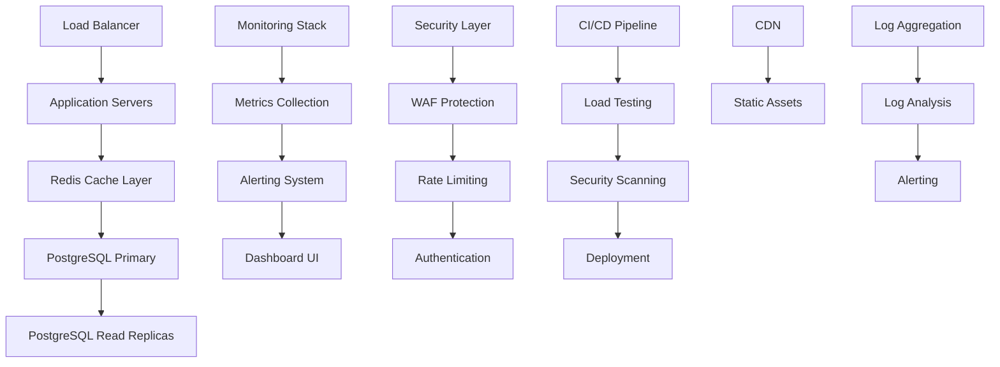

# Technical Design: Quarter 1 Production Enhancement

## Architecture Overview
The Quarter 1 production enhancement transforms the Memex Racing game into an enterprise-grade system with advanced monitoring, scalable database infrastructure, comprehensive testing frameworks, and security hardening. The architecture emphasizes reliability, scalability, and operational excellence.



## Technology Stack
- **Monitoring**: Prometheus + Grafana + AlertManager
- **Database**: PostgreSQL 14+ with read replicas, Redis 7+ for caching
- **Load Testing**: K6 with custom scenarios and reporting
- **Security**: OWASP security tools, Helmet.js, rate limiting
- **Infrastructure**: Docker containers, Kubernetes orchestration
- **Logging**: Structured logging with ELK stack (Elasticsearch, Logstash, Kibana)
- **CDN**: CloudFront or equivalent for global asset delivery

## Component Design

### Component: Advanced Monitoring System
- **Purpose**: Comprehensive system observability with proactive alerting
- **Interfaces**:
  - `collectMetrics(source: string, metrics: MetricData): void`
  - `createAlert(condition: AlertCondition): AlertRule`
  - `generateReport(timeframe: TimeRange): SystemReport`
  - `getHealthStatus(): HealthStatus`
- **Dependencies**: Prometheus, Grafana, custom collectors

### Component: Database Infrastructure
- **Purpose**: Scalable, reliable data storage with high availability
- **Interfaces**:
  - `executeQuery(query: string, params: any[]): Promise<QueryResult>`
  - `getConnection(readonly: boolean): Promise<DatabaseConnection>`
  - `migrateData(source: DataSource, target: DataSource): Promise<MigrationResult>`
  - `optimizePerformance(): Promise<OptimizationReport>`
- **Dependencies**: PostgreSQL, Redis, connection pooling library

### Component: Load Testing Framework
- **Purpose**: Automated performance validation and capacity planning
- **Interfaces**:
  - `createTestScenario(config: TestConfig): TestScenario`
  - `executeLoadTest(scenario: TestScenario): Promise<TestResults>`
  - `generateReport(results: TestResults): PerformanceReport`
  - `detectRegressions(baseline: TestResults, current: TestResults): RegressionReport`
- **Dependencies**: K6, custom test runners, metrics collection

### Component: Security Hardening Suite
- **Purpose**: Comprehensive security protection and compliance
- **Interfaces**:
  - `scanVulnerabilities(): Promise<SecurityReport>`
  - `enforceSecurityPolicies(request: Request): SecurityValidation`
  - `auditCompliance(standard: ComplianceStandard): ComplianceReport`
  - `handleSecurityIncident(incident: SecurityIncident): void`
- **Dependencies**: Security scanning tools, audit frameworks

## Implementation Details

### Monitoring and Alerting System
```javascript
// Prometheus metrics collection
class MetricsCollector {
  constructor() {
    this.promClient = require('prom-client');
    this.register = new this.promClient.Registry();
    
    // Define custom metrics
    this.httpRequestDuration = new this.promClient.Histogram({
      name: 'memex_racing_http_request_duration_seconds',
      help: 'Duration of HTTP requests in seconds',
      labelNames: ['method', 'route', 'status_code'],
      buckets: [0.1, 0.5, 1, 2, 5]
    });
    
    this.activeUsers = new this.promClient.Gauge({
      name: 'memex_racing_active_users',
      help: 'Number of currently active users',
      collect() {
        return this.set(getUserCount());
      }
    });
    
    this.gameEvents = new this.promClient.Counter({
      name: 'memex_racing_game_events_total',
      help: 'Total number of game events',
      labelNames: ['event_type', 'outcome']
    });
    
    this.register.registerMetric(this.httpRequestDuration);
    this.register.registerMetric(this.activeUsers);
    this.register.registerMetric(this.gameEvents);
  }
  
  // Express middleware to collect HTTP metrics
  metricsMiddleware() {
    return (req, res, next) => {
      const start = Date.now();
      
      res.on('finish', () => {
        const duration = (Date.now() - start) / 1000;
        this.httpRequestDuration
          .labels(req.method, req.route?.path || req.path, res.statusCode)
          .observe(duration);
      });
      
      next();
    };
  }
  
  // Custom business metrics
  recordGameEvent(eventType, outcome) {
    this.gameEvents.labels(eventType, outcome).inc();
  }
  
  // Health check endpoint
  getHealthMetrics() {
    return {
      status: 'healthy',
      timestamp: new Date().toISOString(),
      uptime: process.uptime(),
      memory: process.memoryUsage(),
      activeConnections: getActiveConnectionCount()
    };
  }
}

// Alert manager configuration
class AlertManager {
  constructor() {
    this.rules = new Map();
    this.channels = new Map();
  }
  
  createAlertRule(name, condition, severity, channels) {
    const rule = {
      name,
      condition,
      severity,
      channels,
      cooldown: 300000, // 5 minutes
      lastTriggered: null
    };
    
    this.rules.set(name, rule);
    return rule;
  }
  
  evaluateRules(metrics) {
    for (const [name, rule] of this.rules) {
      if (this.evaluateCondition(rule.condition, metrics)) {
        this.triggerAlert(rule);
      }
    }
  }
  
  triggerAlert(rule) {
    const now = Date.now();
    if (rule.lastTriggered && (now - rule.lastTriggered) < rule.cooldown) {
      return; // Still in cooldown
    }
    
    rule.lastTriggered = now;
    
    const alert = {
      rule: rule.name,
      severity: rule.severity,
      timestamp: new Date().toISOString(),
      message: `Alert: ${rule.name} triggered`
    };
    
    rule.channels.forEach(channel => {
      this.sendAlert(channel, alert);
    });
  }
}
```

### Database Infrastructure
```javascript
// Connection pool manager with read/write splitting
class DatabaseManager {
  constructor(config) {
    this.config = config;
    this.writePool = this.createConnectionPool(config.primary);
    this.readPools = config.replicas.map(replica => 
      this.createConnectionPool(replica)
    );
    this.redis = new Redis(config.redis);
  }
  
  createConnectionPool(dbConfig) {
    return new Pool({
      user: dbConfig.user,
      host: dbConfig.host,
      database: dbConfig.database,
      password: dbConfig.password,
      port: dbConfig.port,
      max: 20, // Maximum connections
      min: 5,  // Minimum connections
      idleTimeoutMillis: 30000,
      connectionTimeoutMillis: 2000,
    });
  }
  
  async executeQuery(query, params, options = {}) {
    const isReadOperation = this.isReadQuery(query);
    const pool = isReadOperation ? this.getReadPool() : this.writePool;
    
    const client = await pool.connect();
    
    try {
      // Add query timeout
      const timeoutPromise = new Promise((_, reject) => {
        setTimeout(() => reject(new Error('Query timeout')), 10000);
      });
      
      const result = await Promise.race([
        client.query(query, params),
        timeoutPromise
      ]);
      
      // Cache read queries if specified
      if (isReadOperation && options.cache) {
        await this.redis.setex(
          this.getCacheKey(query, params),
          options.cacheTimeout || 300,
          JSON.stringify(result.rows)
        );
      }
      
      return result;
    } finally {
      client.release();
    }
  }
  
  async getCachedQuery(query, params) {
    const cacheKey = this.getCacheKey(query, params);
    const cached = await this.redis.get(cacheKey);
    
    if (cached) {
      return { rows: JSON.parse(cached), fromCache: true };
    }
    
    return null;
  }
  
  getReadPool() {
    // Simple round-robin load balancing
    const index = Math.floor(Math.random() * this.readPools.length);
    return this.readPools[index];
  }
  
  isReadQuery(query) {
    const readOperations = ['SELECT', 'WITH'];
    const operation = query.trim().toUpperCase().split(' ')[0];
    return readOperations.includes(operation);
  }
}

// Migration system
class DatabaseMigrator {
  constructor(dbManager) {
    this.db = dbManager;
    this.migrations = [];
  }
  
  addMigration(version, up, down) {
    this.migrations.push({ version, up, down });
  }
  
  async migrate() {
    const currentVersion = await this.getCurrentVersion();
    const pendingMigrations = this.migrations.filter(m => m.version > currentVersion);
    
    for (const migration of pendingMigrations) {
      await this.executeMigration(migration);
    }
  }
  
  async executeMigration(migration) {
    const client = await this.db.writePool.connect();
    
    try {
      await client.query('BEGIN');
      await client.query(migration.up);
      await client.query(
        'INSERT INTO schema_migrations (version) VALUES ($1)',
        [migration.version]
      );
      await client.query('COMMIT');
      
      console.log(`Migration ${migration.version} completed successfully`);
    } catch (error) {
      await client.query('ROLLBACK');
      throw new Error(`Migration ${migration.version} failed: ${error.message}`);
    } finally {
      client.release();
    }
  }
}
```

### Load Testing Framework
```javascript
// K6 test scenario generator
class LoadTestManager {
  constructor() {
    this.scenarios = new Map();
    this.baselines = new Map();
  }
  
  createGameplayScenario() {
    return {
      executor: 'ramping-vus',
      startVUs: 0,
      stages: [
        { duration: '2m', target: 100 }, // Ramp up
        { duration: '5m', target: 100 }, // Stay at 100 users
        { duration: '2m', target: 200 }, // Ramp to 200
        { duration: '5m', target: 200 }, // Stay at 200
        { duration: '2m', target: 0 },   // Ramp down
      ],
      gracefulRampDown: '30s',
    };
  }
  
  generateK6Script(scenario) {
    return `
import http from 'k6/http';
import { check, sleep } from 'k6';
import { Rate, Trend } from 'k6/metrics';

// Custom metrics
const loginRate = new Rate('login_success_rate');
const gameJoinTime = new Trend('game_join_duration');

export const options = {
  scenarios: {
    gameplay: ${JSON.stringify(scenario, null, 2)}
  },
  thresholds: {
    http_req_duration: ['p(95)<500'], // 95% of requests under 500ms
    login_success_rate: ['rate>0.95'], // 95% login success rate
    game_join_duration: ['p(90)<2000'], // 90% join under 2s
  }
};

export default function() {
  // Login flow
  const loginStart = Date.now();
  const loginResp = http.post('${process.env.API_URL}/auth/login', {
    username: 'test_user_' + __VU,
    password: 'test_password'
  });
  
  const loginSuccess = check(loginResp, {
    'login successful': (r) => r.status === 200,
  });
  loginRate.add(loginSuccess);
  
  if (!loginSuccess) return;
  
  const token = loginResp.json('token');
  const headers = { Authorization: 'Bearer ' + token };
  
  // Join multiplayer game
  const gameJoinStart = Date.now();
  const joinResp = http.post('${process.env.API_URL}/multiplayer/join', {}, {
    headers: headers
  });
  
  check(joinResp, {
    'game join successful': (r) => r.status === 200,
  });
  
  gameJoinTime.add(Date.now() - gameJoinStart);
  
  // Simulate game actions
  for (let i = 0; i < 10; i++) {
    http.post('${process.env.API_URL}/game/action', {
      action: 'move',
      direction: Math.random() > 0.5 ? 'up' : 'down'
    }, { headers: headers });
    
    sleep(0.5);
  }
  
  // Logout
  http.post('${process.env.API_URL}/auth/logout', {}, {
    headers: headers
  });
  
  sleep(1);
}
    `;
  }
  
  async executeTest(scenarioName) {
    const scenario = this.scenarios.get(scenarioName);
    const script = this.generateK6Script(scenario);
    
    // Write script to temporary file
    const fs = require('fs');
    const scriptPath = `/tmp/k6-${scenarioName}-${Date.now()}.js`;
    fs.writeFileSync(scriptPath, script);
    
    // Execute K6 test
    const { spawn } = require('child_process');
    const k6Process = spawn('k6', ['run', '--out', 'json=results.json', scriptPath]);
    
    return new Promise((resolve, reject) => {
      k6Process.on('close', (code) => {
        if (code === 0) {
          const results = this.parseResults('results.json');
          resolve(results);
        } else {
          reject(new Error(`K6 test failed with code ${code}`));
        }
      });
    });
  }
  
  detectPerformanceRegression(baseline, current) {
    const regressions = [];
    
    // Check response time regression
    if (current.http_req_duration.p95 > baseline.http_req_duration.p95 * 1.2) {
      regressions.push({
        metric: 'response_time',
        baseline: baseline.http_req_duration.p95,
        current: current.http_req_duration.p95,
        degradation: ((current.http_req_duration.p95 / baseline.http_req_duration.p95) - 1) * 100
      });
    }
    
    // Check error rate regression
    if (current.http_req_failed > baseline.http_req_failed * 1.5) {
      regressions.push({
        metric: 'error_rate',
        baseline: baseline.http_req_failed,
        current: current.http_req_failed,
        degradation: ((current.http_req_failed / baseline.http_req_failed) - 1) * 100
      });
    }
    
    return regressions;
  }
}
```

### Security Hardening Implementation
```javascript
// Comprehensive security middleware
class SecurityManager {
  constructor() {
    this.rateLimiters = new Map();
    this.securityRules = new Map();
    this.auditLog = [];
  }
  
  createSecurityMiddleware() {
    return [
      helmet({
        contentSecurityPolicy: {
          directives: {
            defaultSrc: ["'self'"],
            scriptSrc: ["'self'", "'unsafe-inline'"],
            styleSrc: ["'self'", "'unsafe-inline'"],
            imgSrc: ["'self'", "data:", "https:"],
            connectSrc: ["'self'", "wss:", "https:"],
          },
        },
        hsts: {
          maxAge: 31536000,
          includeSubDomains: true,
          preload: true
        }
      }),
      this.rateLimitingMiddleware(),
      this.inputValidationMiddleware(),
      this.auditMiddleware()
    ];
  }
  
  rateLimitingMiddleware() {
    return (req, res, next) => {
      const key = this.getRateLimitKey(req);
      const limiter = this.getRateLimiter(req.route.path);
      
      if (!limiter.tryRequest(key)) {
        this.logSecurityEvent('rate_limit_exceeded', {
          ip: req.ip,
          path: req.path,
          userAgent: req.get('User-Agent')
        });
        
        return res.status(429).json({
          error: 'Rate limit exceeded',
          retryAfter: limiter.getRetryAfter(key)
        });
      }
      
      next();
    };
  }
  
  inputValidationMiddleware() {
    return (req, res, next) => {
      // SQL injection detection
      const sqlPatterns = [
        /(\b(SELECT|INSERT|UPDATE|DELETE|DROP|CREATE|ALTER)\b)/i,
        /(union\s+select)/i,
        /(\b(or|and)\s+\d+\s*=\s*\d+)/i
      ];
      
      // XSS detection
      const xssPatterns = [
        /<script\b[^<]*(?:(?!<\/script>)<[^<]*)*<\/script>/gi,
        /javascript:/i,
        /on\w+\s*=/i
      ];
      
      const requestData = JSON.stringify(req.body) + JSON.stringify(req.query);
      
      // Check for SQL injection
      if (sqlPatterns.some(pattern => pattern.test(requestData))) {
        this.logSecurityEvent('sql_injection_attempt', {
          ip: req.ip,
          data: requestData,
          path: req.path
        });
        return res.status(400).json({ error: 'Invalid input detected' });
      }
      
      // Check for XSS
      if (xssPatterns.some(pattern => pattern.test(requestData))) {
        this.logSecurityEvent('xss_attempt', {
          ip: req.ip,
          data: requestData,
          path: req.path
        });
        return res.status(400).json({ error: 'Invalid input detected' });
      }
      
      next();
    };
  }
  
  auditMiddleware() {
    return (req, res, next) => {
      const auditEntry = {
        timestamp: new Date().toISOString(),
        ip: req.ip,
        method: req.method,
        path: req.path,
        userAgent: req.get('User-Agent'),
        userId: req.user?.id
      };
      
      // Log sensitive operations
      if (this.isSensitiveOperation(req)) {
        this.auditLog.push(auditEntry);
        
        // Persist to database for compliance
        this.persistAuditLog(auditEntry);
      }
      
      next();
    };
  }
  
  scanVulnerabilities() {
    // Integrate with security scanning tools
    return {
      dependencies: this.scanDependencies(),
      configuration: this.scanConfiguration(),
      runtime: this.scanRuntime()
    };
  }
}
```

## Infrastructure Architecture

### Kubernetes Deployment
```yaml
# Application deployment
apiVersion: apps/v1
kind: Deployment
metadata:
  name: memex-racing-app
spec:
  replicas: 3
  selector:
    matchLabels:
      app: memex-racing-app
  template:
    metadata:
      labels:
        app: memex-racing-app
    spec:
      containers:
      - name: app
        image: memex-racing:latest
        ports:
        - containerPort: 3000
        env:
        - name: DATABASE_URL
          valueFrom:
            secretKeyRef:
              name: db-secret
              key: url
        - name: REDIS_URL
          valueFrom:
            secretKeyRef:
              name: redis-secret
              key: url
        resources:
          requests:
            memory: "256Mi"
            cpu: "250m"
          limits:
            memory: "512Mi"
            cpu: "500m"
        livenessProbe:
          httpGet:
            path: /health
            port: 3000
          initialDelaySeconds: 30
          periodSeconds: 10
        readinessProbe:
          httpGet:
            path: /ready
            port: 3000
          initialDelaySeconds: 5
          periodSeconds: 5

---
# Service
apiVersion: v1
kind: Service
metadata:
  name: memex-racing-service
spec:
  selector:
    app: memex-racing-app
  ports:
  - port: 80
    targetPort: 3000
  type: LoadBalancer

---
# Horizontal Pod Autoscaler
apiVersion: autoscaling/v2
kind: HorizontalPodAutoscaler
metadata:
  name: memex-racing-hpa
spec:
  scaleTargetRef:
    apiVersion: apps/v1
    kind: Deployment
    name: memex-racing-app
  minReplicas: 3
  maxReplicas: 20
  metrics:
  - type: Resource
    resource:
      name: cpu
      target:
        type: Utilization
        averageUtilization: 70
  - type: Resource
    resource:
      name: memory
      target:
        type: Utilization
        averageUtilization: 80
```

## Performance Targets

### System Performance
- **Response Time**: 95th percentile < 200ms for all API endpoints
- **Throughput**: Handle 10,000 requests per second at peak
- **Availability**: 99.9% uptime (8.76 hours downtime per year max)
- **Error Rate**: < 0.1% of requests result in 5xx errors

### Database Performance
- **Query Response**: 95th percentile < 100ms
- **Connection Pool**: Maintain 95%+ utilization efficiency
- **Cache Hit Rate**: > 85% for read operations
- **Replication Lag**: < 1 second for read replicas

### Security Performance
- **Vulnerability Scanning**: Complete scan in < 1 hour
- **Threat Detection**: Identify threats within 5 minutes
- **Incident Response**: Activate response within 15 minutes
- **Compliance Reporting**: Generate reports in < 30 minutes

## Deployment Strategy

### Blue-Green Deployment
1. **Preparation**: Deploy new version to green environment
2. **Testing**: Run automated tests against green environment
3. **Validation**: Perform load testing and security scanning
4. **Switch**: Route traffic from blue to green environment
5. **Monitoring**: Monitor metrics for 1 hour post-deployment
6. **Rollback**: Automatic rollback if issues detected

### Database Migration Strategy
1. **Backward Compatibility**: Ensure migrations don't break existing code
2. **Staged Rollout**: Apply migrations to read replicas first
3. **Validation**: Verify data integrity after each migration
4. **Rollback Plan**: Maintain ability to rollback within 1 hour

### Monitoring Deployment
- Real-time deployment progress tracking
- Automated rollback triggers based on error rates
- Performance comparison with previous version
- User impact assessment and communication