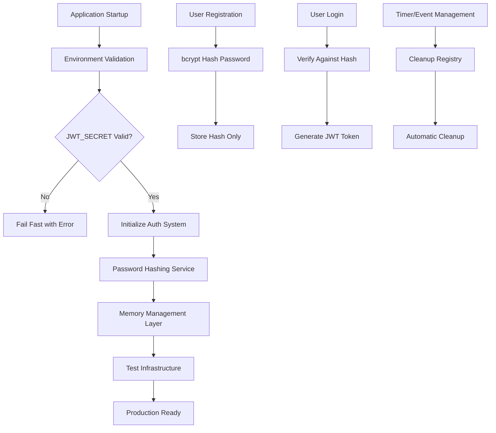

# Technical Design: Week 1 Critical Security & Stability Fixes

## Architecture Overview
The critical fixes target four core areas: JWT configuration, password security, memory management, and test reliability. These fixes will be implemented as surgical changes to minimize risk while addressing production-blocking issues.



## Technology Stack
- **Password Hashing**: bcrypt (industry standard, resistant to timing attacks)
- **Environment Validation**: dotenv with custom validation layer
- **Memory Management**: Custom cleanup registry with lifecycle hooks
- **Testing**: Jest with improved mocking and setup/teardown
- **Logging**: Structured logging for debugging without security exposure

## Component Design

### Component: Environment Configuration Manager
- **Purpose**: Validate and manage environment variables at startup
- **Interfaces**: 
  - `validateEnvironment()`: Checks all required variables
  - `getSecureConfig()`: Returns validated configuration
- **Dependencies**: dotenv, crypto (for validation)

### Component: Password Security Service
- **Purpose**: Handle all password hashing and verification
- **Interfaces**:
  - `hashPassword(plaintext: string): Promise<string>`
  - `verifyPassword(plaintext: string, hash: string): Promise<boolean>`
- **Dependencies**: bcrypt

### Component: Memory Management Registry
- **Purpose**: Track and cleanup resources to prevent memory leaks
- **Interfaces**:
  - `registerTimer(id: string, timer: Timer): void`
  - `registerEventListener(id: string, cleanup: Function): void`
  - `cleanup(scope?: string): void`
- **Dependencies**: None (vanilla JavaScript)

### Component: Test Infrastructure Improvements
- **Purpose**: Ensure reliable test execution with proper mocking
- **Interfaces**:
  - `setupCryptoMocks(): void`
  - `cleanupAfterTest(): void`
  - `mockRequestHeaders(headers: object): void`
- **Dependencies**: Jest, jsdom

## Implementation Details

### JWT Secret Validation
```javascript
// Environment validation with secure defaults
const JWT_CONFIG = {
  minSecretLength: 32,
  forbiddenSecrets: ['default', 'secret', 'password', 'test'],
  requiredStrength: 'high'
};

function validateJWTSecret(secret) {
  if (!secret) {
    throw new ConfigurationError('JWT_SECRET environment variable is required');
  }
  
  if (secret.length < JWT_CONFIG.minSecretLength) {
    throw new ConfigurationError(`JWT secret must be at least ${JWT_CONFIG.minSecretLength} characters`);
  }
  
  if (JWT_CONFIG.forbiddenSecrets.includes(secret.toLowerCase())) {
    throw new ConfigurationError('JWT secret is too weak - use a cryptographically secure random string');
  }
  
  return secret;
}
```

### Password Hashing Service
```javascript
const bcrypt = require('bcrypt');

class PasswordSecurityService {
  constructor(saltRounds = 12) {
    this.saltRounds = saltRounds;
  }
  
  async hashPassword(plaintext) {
    if (!plaintext || typeof plaintext !== 'string') {
      throw new ValidationError('Password must be a non-empty string');
    }
    
    return await bcrypt.hash(plaintext, this.saltRounds);
  }
  
  async verifyPassword(plaintext, hash) {
    if (!plaintext || !hash) {
      // Perform dummy operation to prevent timing attacks
      await bcrypt.hash('dummy', this.saltRounds);
      return false;
    }
    
    return await bcrypt.compare(plaintext, hash);
  }
}
```

### Memory Management Registry
```javascript
class MemoryManagementRegistry {
  constructor() {
    this.timers = new Map();
    this.eventListeners = new Map();
    this.tweens = new Map();
  }
  
  registerTimer(id, timer) {
    // Clear existing timer if present
    if (this.timers.has(id)) {
      clearTimeout(this.timers.get(id));
      clearInterval(this.timers.get(id));
    }
    this.timers.set(id, timer);
  }
  
  registerEventListener(id, element, event, handler) {
    const cleanup = () => element.removeEventListener(event, handler);
    this.eventListeners.set(id, cleanup);
  }
  
  cleanup(scope) {
    // Clear timers
    for (const [id, timer] of this.timers.entries()) {
      if (!scope || id.startsWith(scope)) {
        clearTimeout(timer);
        clearInterval(timer);
        this.timers.delete(id);
      }
    }
    
    // Remove event listeners
    for (const [id, cleanup] of this.eventListeners.entries()) {
      if (!scope || id.startsWith(scope)) {
        cleanup();
        this.eventListeners.delete(id);
      }
    }
    
    // Clean up Phaser tweens
    for (const [id, tween] of this.tweens.entries()) {
      if (!scope || id.startsWith(scope)) {
        if (tween && tween.remove) {
          tween.remove();
        }
        this.tweens.delete(id);
      }
    }
  }
}
```

## Data Model Changes

### User Authentication Schema
```sql
-- Updated user table with proper password hashing
CREATE TABLE users (
    id UUID PRIMARY KEY DEFAULT gen_random_uuid(),
    username VARCHAR(255) UNIQUE NOT NULL,
    email VARCHAR(255) UNIQUE NOT NULL,
    password_hash VARCHAR(255) NOT NULL, -- bcrypt hash only
    created_at TIMESTAMP DEFAULT CURRENT_TIMESTAMP,
    updated_at TIMESTAMP DEFAULT CURRENT_TIMESTAMP,
    is_active BOOLEAN DEFAULT true
);

-- Remove any existing plaintext password columns
ALTER TABLE users DROP COLUMN IF EXISTS password;
```

### Configuration Schema
```javascript
// Environment configuration schema
const ENV_SCHEMA = {
  JWT_SECRET: {
    required: true,
    minLength: 32,
    validation: 'secure'
  },
  NODE_ENV: {
    required: true,
    enum: ['development', 'production', 'test']
  },
  DATABASE_URL: {
    required: true,
    format: 'url'
  }
};
```

## Testing Strategy

### Unit Tests
- **JWT Configuration**: Test validation logic with various secret formats
- **Password Hashing**: Test bcrypt integration with timing attack prevention
- **Memory Management**: Test cleanup functions with mock timers and events
- **Environment Validation**: Test startup behavior with missing/invalid config

### Integration Tests
- **Authentication Flow**: End-to-end login/register with real password hashing
- **Memory Leak Detection**: Long-running tests to verify cleanup effectiveness
- **Configuration Loading**: Test production startup scenarios

### Test Infrastructure Improvements
```javascript
// Improved crypto mocking
beforeEach(() => {
  const mockGetRandomValues = jest.fn((array) => {
    for (let i = 0; i < array.length; i++) {
      array[i] = Math.floor(Math.random() * 256);
    }
    return array;
  });
  
  Object.defineProperty(global, 'crypto', {
    value: { getRandomValues: mockGetRandomValues },
    writable: true
  });
});

// Proper request header mocking
const mockRequest = {
  headers: {
    'x-forwarded-proto': 'https'
  },
  secure: false
};
```

## Security Considerations

### JWT Security
- Secrets must be generated using cryptographically secure random number generators
- Secret rotation capability should be planned for future implementation
- Secrets must never be logged or exposed in error messages

### Password Security
- Use bcrypt with salt rounds >= 12 (adjustable based on hardware)
- Implement timing attack prevention in verification
- Never log or expose password hashes
- Consider password strength requirements from existing PasswordValidator

### Memory Security
- Ensure sensitive data is properly cleared from memory
- Prevent memory dumps from exposing authentication tokens
- Clean up any temporary password storage immediately

## Performance Considerations

### Startup Performance
- Environment validation should complete in < 100ms
- Configuration loading should be cached after initial validation
- Fail-fast approach prevents slow startup on misconfiguration

### Authentication Performance
- bcrypt operations should complete in < 500ms
- Consider caching validation results for repeated operations
- Memory cleanup should have minimal impact on response times

### Memory Performance
- Cleanup registry should have minimal memory overhead
- Automatic cleanup should prevent memory growth over time
- Monitor memory usage patterns in production

## Migration Strategy

### Database Migration
```sql
-- Step 1: Add new password_hash column
ALTER TABLE users ADD COLUMN password_hash VARCHAR(255);

-- Step 2: Create migration script to hash existing passwords
-- (This will be a one-time operation during deployment)

-- Step 3: Make password_hash NOT NULL after migration
ALTER TABLE users ALTER COLUMN password_hash SET NOT NULL;

-- Step 4: Remove old password column
ALTER TABLE users DROP COLUMN password;
```

### Configuration Migration
1. Generate secure JWT_SECRET for production
2. Update environment variables in deployment pipeline
3. Test configuration validation in staging environment
4. Deploy with new validation enabled

### Memory Management Integration
1. Identify all current timer/event usage
2. Integrate cleanup registry incrementally
3. Add cleanup calls to existing lifecycle methods
4. Monitor memory usage before and after changes

## Rollback Plan

### Database Rollback
- Keep backup of user table before password hash migration
- Maintain ability to restore previous authentication system
- Document manual verification steps for rollback success

### Configuration Rollback
- Maintain previous environment configuration as backup
- Document steps to disable new validation temporarily
- Ensure application can start with previous configuration

### Code Rollback
- Tag current working version before applying fixes
- Ensure all changes are feature-flagged where possible
- Document specific files modified for easy reversion

## Monitoring and Alerting

### Production Monitoring
- Track authentication success/failure rates
- Monitor memory usage patterns
- Alert on configuration validation failures
- Track application startup times

### Security Monitoring
- Log authentication attempts (without sensitive data)
- Monitor for password enumeration attempts
- Track JWT token validation failures
- Alert on security-related errors

## Deployment Checklist

### Pre-deployment
- [ ] All 279 tests passing
- [ ] JWT_SECRET configured in production environment
- [ ] Database migration scripts tested
- [ ] Memory leak tests completed
- [ ] Security audit of password hashing implementation

### Deployment
- [ ] Deploy to staging environment
- [ ] Run full test suite in staging
- [ ] Verify authentication flows work correctly
- [ ] Monitor memory usage for 1 hour minimum
- [ ] Deploy to production with monitoring

### Post-deployment
- [ ] Verify application startup successful
- [ ] Test user registration and login flows
- [ ] Monitor memory usage patterns
- [ ] Verify test suite still passes
- [ ] Document any issues encountered